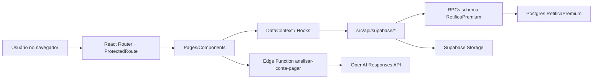

# Contexto Técnico Completo — Retiflow / Retífica Premium

> Atualizado em: 2026-05-01
> Repositório local: `/Users/gabrielwilliamdepaulo/Documents/RetificaPremium/retiflow`
> GitHub: `Gabrieldepaulo20/RetiFlow`
> Branch principal: `main`
> Último commit validado neste contexto: pendente do commit desta rodada de tenant isolation
> Escopo desta documentação: sistema Retiflow exceto Nota Fiscal, que ainda deve ser tratada como fora da v1/piloto.

Este arquivo foi escrito para ser entregue a outro modelo de IA ou revisor técnico. A intenção é dar contexto suficiente para análise de arquitetura, segurança, banco, frontend, integração Supabase, riscos restantes e oportunidades de melhoria.

---

## 1. Resumo Executivo

O Retiflow é uma SPA em React/Vite para operação de uma retífica. O sistema evoluiu de uma base visual/local para uma aplicação parcialmente conectada ao Supabase real. Hoje, os fluxos mais importantes para piloto controlado estão conectados de verdade: autenticação real, clientes, notas de serviço, Kanban/status, fechamento mensal, contas a pagar, anexos privados de contas, sugestões de e-mail, logs e testes de integração reais.

Estado atual honesto:

| Área | Estado |
|---|---|
| Auth real | Funcional via Supabase Auth + perfil interno em schema `RetificaPremium` |
| Rotas protegidas | Protegidas no frontend por `ProtectedRoute`; backend precisa continuar validando RPC/RLS |
| Clientes | Integrado ao Supabase via RPCs |
| Notas de serviço/O.S. | Integradas ao Supabase via RPCs; PDF é gerado no front e salvo no Storage |
| Preview/PDF de O.S. | Funcional e otimizado visualmente, mas deve ser validado manualmente em vários tamanhos de tela/impressão |
| Fechamento mensal | Integrado ao Supabase para geração/salvamento/PDF; rascunhos ainda usam `localStorage` de forma intencional |
| Contas a pagar | Integrado ao Supabase via RPCs, storage privado, IA via Edge Function |
| Sugestões de e-mail/Gmail | RPC real + OAuth Gmail implantado; sugestões isoladas por usuário/tenant |
| Logs/histórico | Agora lê e insere no Supabase via `get_logs`/`insert_log` |
| Nota Fiscal | Fora da v1; rota mantém aviso de indisponibilidade e ações fake foram removidas |
| Configurações | Empresa, módulos e modelos persistem no Supabase; aparência/logo/senha seguem marcadas como prévias/indisponíveis |
| Admin/Master | Hierarquia Mega Master/Master implementada via Edge Function `admin-users`; Mega Master é protegido |
| Exclusão de usuários | Mega Master possui exclusão em cascata auditada para dados tecnicamente vinculados ao usuário |
| Presença online | Mega Master consegue ver usuários online, última atividade e rota atual via RPC/Edge Function |
| Tenant isolation operacional | Clientes, O.S., contas a pagar e fechamentos agora são filtrados server-side por usuário autenticado |
| Signup público/Auth hardening | Signup direto com anon key bloqueado no Supabase Auth; RPCs administrativas sensíveis restritas |
| RPC/API hardening | `PUBLIC`/`anon` sem execução em RPCs `RetificaPremium`; `anon/authenticated` sem grants diretos de tabela |
| Testes | Unit tests e integration tests reais passando; auth provider tem teste contra mock em produção |

Validações executadas recentemente:

| Comando | Resultado |
|---|---|
| `npx tsc --noEmit` | Passou |
| `npm run build` | Passou |
| `npm run lint` | Passou com warnings, sem erros |
| `npm test -- --run` | 262 testes passaram |
| `npm run test:integration` | 33 testes passaram contra Supabase real |
| `npm run test:e2e -- --project=chromium` | 38 testes passaram |

Avisos ainda existentes:

- `npm run lint` tem 8 warnings antigos de Fast Refresh em componentes UI/AuthContext; o warning de dependência de hook em `NoteFormCore.tsx` foi corrigido.
- Build alerta chunks grandes, especialmente `react-pdf.browser`, `xlsx`, charts e bundle principal.
- Fase 9B prepara `notas` como bucket privado: novos PDFs de O.S. salvam path em `pdf_url` e a leitura usa signed URL sob demanda.
- Tokens Supabase ficam no navegador, como em qualquer SPA com Supabase Auth. Isso exige CSP forte, ausência de XSS e RPC/RLS bem feitos no banco.
- A `anon key` é pública por design, mas não pode conceder cadastro ou escrita sensível. Em 2026-05-04 o Auth foi endurecido: `disable_signup=true`, `mailer_autoconfirm=false`, senha mínima 10 e reautenticação para troca de senha.
- Em 2026-05-04 também foi removido `EXECUTE` de `PUBLIC/anon` nas RPCs de negócio. Chamadas anônimas passam a falhar por permissão antes de entrar na função. Usuários autenticados continuam usando RPCs; operações administrativas sensíveis ficam restritas a `service_role` via Edge Function.
- O Supabase Auth está com rotação de refresh token ativa, MFA TOTP habilitado, manual linking desabilitado e notificações de segurança de alteração de senha/e-mail/identidade/MFA habilitadas. Proteção HIBP/leaked password foi tentada, mas o Supabase informou que exige plano Pro ou superior.
- Em 2026-05-04 foi adicionada camada frontend de MFA TOTP: login detecta `aal1 -> aal2` e exige código do aplicativo autenticador antes de liberar a sessão no app; Configurações > Segurança permite cadastrar/remover autenticador TOTP usando APIs oficiais do Supabase. Controles avançados de sessão por tempo máximo/inatividade existem no Supabase, mas a documentação informa que são recurso de plano Pro ou superior.
- Modo suporte/impersonação ainda troca o usuário efetivo no frontend. Como as RPCs operacionais agora usam `auth.uid()` real para isolamento, o modo suporte não deve ser usado como prova de acesso aos dados do cliente até existir um fluxo server-side explícito de suporte.

---

## 2. Stack e Premissas

| Camada | Tecnologia |
|---|---|
| Frontend | Vite + React 18 + TypeScript |
| Roteamento | React Router v6 |
| UI | Tailwind CSS + Radix UI/shadcn-style |
| Estado global legado | `DataContext` |
| Server state parcial | TanStack Query em áreas de admin/usuários |
| Auth | Supabase Auth em `VITE_AUTH_MODE=real`; mock em dev |
| Banco | Supabase Postgres, schema customizado `RetificaPremium` |
| API | RPCs Postgres via `.schema('RetificaPremium').rpc()` |
| Storage | Supabase Storage |
| Edge Function | `analisar-conta-pagar`, Deno + OpenAI Responses API |
| PDF | `@react-pdf/renderer` + templates React |
| Deploy | AWS Amplify conectado ao GitHub/main |

Padrão importante:

- O frontend não chama tabelas diretamente para dados de negócio principais.
- A camada `src/api/supabase/*` encapsula RPCs e Storage.
- O schema usado é `RetificaPremium`.
- A service role key nunca deve ir para o frontend.
- O frontend usa anon key pública e access token de usuário autenticado.

---

## 3. Arquitetura de Pastas

```txt
src/
  App.tsx
    Define providers globais, BrowserRouter, layouts, rotas protegidas e lazy loading.

  api/
    supabase/
      _base.ts
        Gateway `callRPC()`. Valida envelope padrão `{ status, mensagem, dados }`.
      auth.ts
        Login/perfil/sessão via Supabase.
      clientes.ts
        RPCs e adapters de clientes.
      notas.ts
        RPCs de notas de serviço/compra, status, upload PDF O.S.
      fechamentos.ts
        RPCs de fechamento, upload PDF privado, signed URL.
      contas-pagar.ts
        RPCs de contas, anexos, storage privado, Edge Function de IA.
      categorias.ts
        Categorias de contas a pagar.
      fornecedores.ts
        Fornecedores.
      sugestoes-email.ts
        Sugestões de e-mail e aceite/ignore via RPC.
      logs.ts
        Leitura e inserção de logs.
      usuarios.ts
        Usuários internos e módulos/permissões.
      admin-users.ts
        Chamada segura da Edge Function `admin-users` para convite/reset/módulos/status.
      presence.ts
        Heartbeat e leitura indireta de presença online/último acesso.
      empresa.ts
        Configurações persistidas de empresa por usuário.
      modelos.ts
        Configurações persistidas de templates de O.S. e fechamento por usuário.
      support.ts
        Chamados de suporte persistidos e envio via Edge Function.
      catalogo.ts
        Catálogos: tipos de motor, serviços, peças/produtos.

  components/
    auth/
      ProtectedRoute.tsx
        Proteção frontend por auth, role e módulo.
    clients/
      Formulários e detalhes de cliente.
    notes/
      Formulário, detalhe, PDF template de O.S.
    closing/
      Templates HTML/PDF de fechamento.
    payables/
      Módulo Contas a Pagar: criação, detalhes, importação IA, sugestões.
    layout/
      Layout operacional e admin.
    ui/
      Componentes base.

  contexts/
    AuthContext.tsx
      Sessão, login/logout, permissões de módulo.
    DataContext.tsx
      Estado global e bridge entre legado localStorage + Supabase real.

  services/
    auth/
      Providers real/mock, permissões, mapeamento de usuários Supabase.
    domain/
      Regras puras de domínio: clientes, notas, contas, fechamento.
    storage/
      Helpers de localStorage versionado.

  pages/
    Login.tsx / AdminLogin.tsx
    Dashboard.tsx
    Clients.tsx / ClientForm.tsx / ClientDetail.tsx
    IntakeNotes.tsx / IntakeNoteForm.tsx / IntakeNoteDetail.tsx
    Kanban.tsx
    MonthlyClosing.tsx
    ContasAPagar.tsx / ContaPagarForm.tsx / ImportarContaPagar.tsx
    Settings.tsx
    Invoices.tsx
    admin/AdminDashboard.tsx / admin/AdminClients.tsx

  test/
    Unit/domain/UI tests.
    integration/
      Testes reais contra Supabase, isolados por `.env.integration`.

supabase/
  functions/
    analisar-conta-pagar/
      Edge Function que autentica usuário, valida arquivo e chama OpenAI.
    admin-users/
      Edge Function sensível para convite/reset/módulos/suporte/exclusão/presença, sempre com service role apenas no backend.
    dashboard-resumo/
      Edge Function que consolida dados do Dashboard em uma chamada autenticada.
    support-ticket/
      Edge Function de chamados de suporte com envio por SES.
  migrations/
    20260426153000_create_contas_pagar_storage.sql
      Bucket privado `contas-pagar` e policies de storage.
    20260427143000_grant_custom_schema_to_service_roles.sql
      Grants para service_role e supabase_auth_admin no schema customizado.

docs/
  contexto-sessao.md
```

---

## 4. Fluxo Arquitetural Geral



Responsabilidades:

- Componentes cuidam de UI, modais, formulários e feedback.
- `services/domain/*` concentra regras puras e testáveis.
- `api/supabase/*` concentra integração externa.
- `DataContext` ainda é uma peça central de compatibilidade; ele deve ser reduzido no futuro em favor de hooks por domínio/TanStack Query.
- RPCs são a fronteira real de segurança e consistência do backend.

---

## 5. Autenticação e Autorização

### 5.1 Modos de Auth

Arquivo principal: `src/services/auth/authProvider.ts`

- `VITE_AUTH_MODE=mock`: usa mock local para desenvolvimento.
- `VITE_AUTH_MODE=real`: usa Supabase Auth.
- Em build de produção (`import.meta.env.PROD`) com mode diferente de `real`, o provider lança erro e bloqueia uso silencioso de auth mock em produção.

### 5.2 Auth real

Arquivos:

- `src/lib/supabase.ts`
- `src/services/auth/realAuthProvider.ts`
- `src/contexts/AuthContext.tsx`

Fluxo:

1. Usuário faz login com `supabase.auth.signInWithPassword`.
2. Supabase retorna `access_token`, `refresh_token`, `expires_at`.
3. App chama RPC `get_usuario_por_auth_id` no schema `RetificaPremium`.
4. Perfil interno é convertido via `dbUserToSystemUser`.
5. Em modo real, o app mantém somente o perfil do usuário no estado React.
6. A persistência de tokens fica exclusivamente com o Supabase SDK (`persistSession: true`).
7. `auth.session` continua existindo apenas para modo mock/dev e é removido automaticamente no modo real.

### 5.3 Risco do access token no navegador

Este é um ponto importante de segurança:

- A `VITE_SUPABASE_ANON_KEY` é pública por design e fica no bundle frontend.
- A anon key sozinha não deve dar acesso amplo; quem protege é RLS/RPC/auth checks.
- Após login, o navegador recebe `access_token` e `refresh_token`.
- Se houver XSS, extensão maliciosa ou script de terceiro comprometido, um atacante pode roubar o token.
- Com o token roubado, o atacante pode chamar diretamente qualquer RPC/Storage permitido àquele usuário, mesmo sem passar pela UI.
- Portanto, `ProtectedRoute` não é segurança suficiente. Ele só protege navegação visual.
- Segurança real precisa estar no banco/Storage/Edge Functions.

Estado atual:

- Edge Function de IA exige `Authorization: Bearer <access_token>` e valida `auth.getUser(token)`.
- Integration tests validam que RPCs críticas de contas a pagar retornam 401 sem auth.
- O app usa RPCs para operações principais, evitando acesso direto a tabelas pelo frontend.
- Ainda é necessário auditar função por função no banco para garantir que todas verificam `auth.uid()`, usuário ativo e permissões/módulos quando aplicável.

Recomendações para endurecer:

- CSP forte em produção, sem `unsafe-inline` quando possível.
- Evitar bibliotecas/scripts externos desnecessários.
- Não armazenar dados sensíveis adicionais em `localStorage`.
- O espelhamento manual de tokens em `auth.session` foi removido no modo real; não reintroduzir sem uma justificativa forte.
- Implementar checks de permissão/módulo no backend para RPCs sensíveis, não apenas no frontend.
- Tornar todos os buckets com documentos sensíveis privados e usar signed URLs curtas.

### 5.4 Ataque por alteração de URL

Se alguém alterar a URL manualmente, por exemplo `/admin` ou `/contas-a-pagar`:

- O `ProtectedRoute` verifica sessão, role e módulo no frontend.
- Em modo real, rotas protegidas revalidam o perfil/módulos via Supabase antes de renderizar a página.
- Usuário não autenticado é redirecionado para login.
- Usuário sem módulo é redirecionado para `/acesso-negado`.

Limite:

- Isso não impede chamadas diretas a RPCs se o atacante tiver token válido.
- A proteção definitiva precisa estar nas RPCs/RLS.

### 5.5 Login Master no portal operacional

Regra atual:

- Um usuário Master/Admin pode entrar por `/admin/login` para administrar a plataforma.
- O mesmo Master/Admin também pode entrar por `/login` para testar o sistema como operação/cliente.
- Ao entrar pelo portal operacional, o app redireciona para o primeiro módulo operacional liberado, normalmente `/dashboard`, e evita cair automaticamente em `/admin`.
- Isso não dá acesso extra: módulos continuam respeitando `moduleAccess` e `ProtectedRoute`.
- O objetivo é permitir teste real das funcionalidades sem criar uma conta operacional separada para cada validação.

---

## 6. Supabase — Arquitetura

### 6.1 Projeto e ambiente

Projeto Supabase vinculado localmente:

- Project ref usado nos testes: `dqeoxxokvvcpssajycgq`
- Nome local observado: `Portal de Notas`
- Schema principal: `RetificaPremium`

Arquivos sensíveis:

- `.env.local`: ignorado pelo git.
- `.env.integration`: ignorado pelo git.
- `.env.integration.example`: versionado, sem segredos.

Variáveis relevantes:

```txt
VITE_AUTH_MODE=real
VITE_SUPABASE_URL=...
VITE_SUPABASE_ANON_KEY=...
VITE_SUPABASE_PAYABLE_ATTACHMENTS_BUCKET=contas-pagar
OPENAI_API_KEY=...        # somente em Supabase Function secret
```

Não deve existir no frontend:

```txt
VITE_SUPABASE_SERVICE_ROLE_KEY
OPENAI_API_KEY
AWS_SECRET_ACCESS_KEY
```

### 6.2 Padrão de RPC

Arquivo: `src/api/supabase/_base.ts`

```ts
supabase.schema('RetificaPremium').rpc(rpcName, params)
```

Contrato esperado:

```ts
{
  status: number;
  mensagem: string;
  total?: number;
  dados?: T;
}
```

Exceções conhecidas:

- `get_conta_pagar_detalhes` retorna envelope/objeto com dados na raiz (`conta`, `anexos`, `historico`, `parcelas`), por isso o wrapper aceita `env.dados ?? env`.
- `insert_log` retorna `void`, por isso não usa `callRPC()`, chama `supabase.schema(...).rpc()` diretamente e valida apenas erro de transporte.
- Algumas mutations de fechamento podem retornar `void` ou envelope; `fechamentos.ts` tem `callMutationRPC()` para isso.

### 6.3 Mapeamento de wrappers e RPCs consumidas

| Arquivo | Funções frontend | RPC/Storage/Function |
|---|---|---|
| `_base.ts` | `callRPC`, `extractDados` | Gateway RPC |
| `auth.ts` | `autenticar`, `sair`, `getPerfil`, `getSessaoAtual` | Supabase Auth, `get_usuario_por_auth_id` |
| `clientes.ts` | `getClientes`, `getClienteDetalhes`, `novoCliente`, `salvarClienteCompleto`, `updateCliente`, `inativarCliente`, `reativarCliente` | `get_clientes`, `get_cliente_detalhes`, `novo_cliente`, `salvar_cliente_completo`, `update_cliente`, `inativar_cliente`, `reativar_cliente` |
| `notas.ts` | `getNotasServico`, `getNotaServicoDetalhes`, `updateNotaPdfUrl`, `uploadNotaPDF`, `getNotasCompra`, `getNotaCompraDetalhes`, `getStatusNotas`, `novaNota`, `updateNotaServico` | `get_notas_servico`, `get_nota_servico_detalhes`, `update_nota_pdf_url`, Storage `notas`, `get_notas_compra`, `get_nota_compra_detalhes`, `get_status_notas`, `nova_nota`, `update_nota_servico` |
| `fechamentos.ts` | `getFechamentos`, `insertFechamento`, `updateFechamento`, `registrarAcaoFechamento`, `getNotaDetalhesParaFechamento`, `uploadFechamentoPDF`, `getFechamentoPDFSignedUrl` | `get_fechamentos`, `insert_fechamento`, `update_fechamento`, `registrar_acao_fechamento`, `get_nota_servico_detalhes`, Storage privado `fechamentos` |
| `contas-pagar.ts` | `getContasPagar`, `getContaPagarDetalhes`, `insertContaPagar`, `updateContaPagar`, `registrarPagamento`, `cancelarContaPagar`, `excluirContaPagar`, `insertAnexoContaPagar`, `uploadAnexoContaPagar`, `getAnexoContaPagarUrl`, `analisarContaPagarComIA` | RPCs de contas, Storage privado `contas-pagar`, Edge Function `analisar-conta-pagar` |
| `categorias.ts` | `getCategorias`, `insertCategoria`, `updateCategoria` | `get_categorias_conta_pagar`, `insert_categoria_conta_pagar`, `update_categoria_conta_pagar` |
| `fornecedores.ts` | `getFornecedores`, `insertFornecedor`, `updateFornecedor`, `inativarFornecedor` | `get_fornecedores`, `insert_fornecedor`, `update_fornecedor`, `inativar_fornecedor` |
| `sugestoes-email.ts` | `getSugestoesEmail`, `insertSugestaoEmail`, `aceitarSugestaoEmail`, `ignorarSugestaoEmail` | `get_sugestoes_email`, `insert_sugestao_email`, `aceitar_sugestao_email`, `ignorar_sugestao_email` |
| `logs.ts` | `getLogs`, `insertLog` | `get_logs`, `insert_log` |
| `usuarios.ts` | `getUsuarios`, `insertUsuario`, `updateUsuario`, `inativarUsuario`, `reativarUsuario`, `upsertModulo` | `get_usuarios`, `insert_usuario`, `update_usuario`, `inativar_usuario`, `reativar_usuario`, `upsert_modulo` |
| `admin-users.ts` | `callAdminUsersFunction` | Edge Function `admin-users` para convite/criação, reset de senha, módulos e status |
| `empresa.ts` | `getConfiguracaoEmpresaUsuario`, `upsertConfiguracaoEmpresaUsuario` | `get_configuracao_empresa_usuario`, `upsert_configuracao_empresa_usuario` |
| `modelos.ts` | `getConfiguracaoModeloUsuario`, `upsertConfiguracaoModeloUsuario` | `get_configuracao_modelo_usuario`, `upsert_configuracao_modelo_usuario` |
| `support.ts` | `getChamadosSuporte`, `enviarChamadoSuporte` | `get_chamados_suporte`, Edge Function `support-ticket` |
| `catalogo.ts` | `getTiposDeMotor`, `getServicosItens`, `getPecasProdutos` | `get_tipos_de_motor`, `get_servicos_itens`, `get_pecas_produtos` |
| `faturas.ts` | `getFaturas`, `getFaturaDetalhes`, `insertFatura`, `updateFatura`, `cancelarFatura` | RPCs de faturas, porém Nota Fiscal está fora da v1 |

### 6.4 Tabelas/entidades inferidas do banco

Observação transparente: este mapeamento é baseado nos wrappers, tipos, RPCs, testes e migrations versionadas. A introspecção completa via Supabase CLI travou durante tentativa de consulta de metadados em 2026-04-27, então recomenda-se confirmar o dump exato no Dashboard/Supabase SQL antes de grandes mudanças estruturais.

Entidades centrais identificadas:

| Entidade/Tabela provável | Uso | Forma normal / observação |
|---|---|---|
| `Usuarios` | Perfil interno vinculado ao Supabase Auth por `auth_id` | Normalizada; separa Auth externo de perfil de negócio |
| `Modulos` | Permissões de acesso por usuário/módulo | Normalizada; 1:1/1:N com usuário dependendo do desenho |
| `Clientes` | Cadastro de cliente B2B/B2C | Normalizada; documento, status, nome, observação |
| `Contatos` | Telefones/e-mails de cliente | Normalizada; evita colunas repetidas |
| `Enderecos` | Endereço de cliente | Normalizada; usada em `novo_cliente`/`salvar_cliente_completo` |
| `Veiculos` | Veículo vinculado a cliente/nota | Normalizada; modelo, placa, km, motor |
| `Tipos_de_Motor` | Catálogo | Normalizada |
| `Servicos_Itens` | Catálogo de serviços | Normalizada |
| `Pecas_Produtos` | Catálogo de peças/produtos | Normalizada |
| `Status_Notas` | Status de serviço/compra | Normalizada; mapeada para enum frontend |
| `Notas_de_Servico` | O.S./nota de serviço | Normalizada; cabeçalho da nota |
| `Notas_de_Compra` | Notas de compra vinculadas | Existe RPC, uso UI ainda limitado |
| Relação de itens da nota | Itens/serviços/produtos da O.S. | Normalizada; detalhes vêm de `get_nota_servico_detalhes` |
| `Fechamentos` | Fechamento mensal por cliente/período | Híbrido: dados principais + `dados_json` snapshot |
| Histórico de fechamento | Ações/regenerações/downloads | Normalizado via `registrar_acao_fechamento` |
| `Contas_Pagar` | Contas financeiras | Normalizada; status, vencimento, recorrência, valores |
| `Categorias_Conta_Pagar` | Categorias financeiras | Normalizada |
| `Fornecedores` | Fornecedores | Normalizada |
| `Anexos_Conta_Pagar` | Metadados de arquivos no storage | Normalizada; arquivo real fica no Storage |
| `Historico_Conta_Pagar` | Histórico de ações financeiras | Normalizada |
| `Sugestoes_Email` | Sugestões vindas de e-mail/IA | Normalizada; aceita/ignora por RPC |
| `Logs` | Log geral do sistema | Normalizada; lida por `get_logs` |
| `Configuracoes_Empresa_Usuario` | Dados da empresa por usuário/cliente | Persistida por RPC; usada na aba Empresa de Settings |
| `Configuracoes_Modelos_Usuario` | Modelos e cores de O.S./fechamento por usuário/cliente | Persistida por RPC; usada nos templates de PDF |
| `Chamados_Suporte` | Chamados/sugestões enviados pelo usuário | Persistida por RPC/Edge Function; envio via SES |
| `Gmail_Connections` / `Gmail_OAuth_States` / `Gmail_Scanned_Messages` | Base planejada para Gmail/Workspace | Estrutura preparada; ingestão automática ainda depende de configuração OAuth/Cron |
| `Faturas` | Nota Fiscal/faturas | Fora da v1 |

Sobre formas normais:

- A maior parte do modelo parece aderir a 3FN: entidades separadas, relações por FK, catálogos isolados, anexos como metadados separados.
- Exceção deliberada: `Fechamentos.dados_json` é um snapshot denormalizado da composição do fechamento. Isso é aceitável para documento financeiro congelado/versão impressa, desde que o fechamento não dependa desse JSON para ser fonte única de verdade editável.
- Exceção operacional: rascunhos de fechamento ficam em `localStorage` antes de virar fechamento real no banco. Isso é aceitável como rascunho local, mas não como dado final.
- Configurações de empresa e modelos já possuem tabelas/RPCs próprias. Tema visual, logo persistida e troca de senha do próprio usuário ainda não têm persistência/fluxo completo na UI.

### 6.5 Buckets de Storage

| Bucket | Público? | Uso | Estado |
|---|---:|---|---|
| `contas-pagar` | Não | Anexos de contas a pagar; PDF, imagens, DOC/DOCX | Criado por migration; policies para authenticated; signed URL de 10 min |
| `fechamentos` | Não | PDFs de fechamento mensal | Usado com signed URL de 1h; integration test valida upload e leitura |
| `notas` | Não, após migration `20260428110000_private_notas_storage.sql` | PDFs de O.S./nota de serviço | Novos PDFs salvam path em `pdf_url`; leitura usa signed URL de 1h; URLs públicas legadas parseáveis continuam compatíveis |

Recomendação:

- Aplicar a migration do bucket `notas` antes da produção ampla.
- Padronizar caminhos por ano/mês/entidade e limpar arquivos órfãos quando registros forem removidos/cancelados.
- Limitação atual: paths de `notas` não carregam tenant/cliente/usuário; as policies mínimas permitem acesso ao bucket para usuários autenticados. Para isolamento fino por cliente/unidade será necessária uma modelagem adicional de path + policy.

### 6.6 Edge Function `analisar-conta-pagar`

Arquivo: `supabase/functions/analisar-conta-pagar/index.ts`

Fluxo:

1. Aceita apenas `POST` e `OPTIONS`.
2. Valida `Authorization: Bearer <access_token>`.
3. Usa `SUPABASE_URL` e `SUPABASE_ANON_KEY` dentro da function para chamar `auth.getUser(token)`.
4. Rejeita sem usuário válido.
5. Lê `OPENAI_API_KEY` de secret da Supabase Function.
6. Valida MIME type:
   - PDF
   - PNG/JPEG/WEBP
   - DOC/DOCX
7. Limita arquivo a 15 MB.
8. Envia arquivo para OpenAI Files API com `purpose=user_data`.
9. Chama OpenAI Responses API usando `gpt-4.1-mini`.
10. Pede JSON estruturado com campos de conta a pagar.
11. Sanitiza saída, limita tamanhos, normaliza datas/valores/categorias.
12. Remove arquivo temporário da OpenAI em `finally`.

Pontos positivos:

- Não expõe OpenAI key no frontend.
- Exige usuário autenticado.
- Valida tipo e tamanho.
- Sanitiza resposta da IA.
- Remove arquivo temporário da OpenAI.

Riscos:

- CORS aceita allowlist via `CORS_ALLOWED_ORIGINS`/`ALLOWED_ORIGINS`; sem env configurada mantém `*` por compatibilidade. Como exige bearer token, CORS não abre acesso sozinho, mas a allowlist deve ser definida em produção.
- IA pode errar valor/data. A UI precisa manter revisão/correção humana.
- A categoria fallback depende da lista enviada pelo frontend.

---

## 7. DataContext e Persistência

Arquivo: `src/contexts/DataContext.tsx`

O `DataContext` é o coração legado do app. Ele centraliza dados e ações, e hoje trabalha em dois modos:

- modo mock/desenvolvimento: seed + localStorage;
- modo real: Supabase para entidades principais.

Em modo real (`VITE_AUTH_MODE=real`), o contexto limpa do estado inicial local:

- clientes
- notas
- serviços/produtos
- anexos
- invoices
- atividades/logs
- contas a pagar
- anexos/histórico de contas
- sugestões de e-mail

Depois carrega do Supabase:

- `getClientes`
- `getNotasServico`
- `getStatusNotas`
- `getContasPagar`
- `getCategorias`
- `getFornecedores`
- `getLogs`
- `getSugestoesEmail`

Pontos positivos:

- Evita exibir seed/localStorage antigo em modo real.
- Centraliza adapters Supabase → tipos frontend.
- Permite transição gradual de app local para app real.

Riscos/manutenção:

- `DataContext` está grande e acoplado.
- Mistura UI-state, server-state, persistência local e regra de negócio.
- Longo prazo: dividir por domínio com hooks próprios (`useClients`, `useNotes`, `usePayables`, `useClosings`) e TanStack Query.

---

## 8. Módulos e Estado Real

### 8.1 Login/Auth

| Item | Estado |
|---|---|
| Login operacional | Real via Supabase Auth |
| Login admin | Real via Supabase Auth |
| Perfil interno | RPC `get_usuario_por_auth_id` |
| Usuário inativo | Bloqueado no login real |
| Sessão persistida | Supabase SDK em modo real; `auth.session` apenas em mock/dev |
| Auth mock em produção | Bloqueado por throw em `getAuthProvider()` |

### 8.2 Clientes

Arquivos:

- `src/pages/Clients.tsx`
- `src/components/clients/*`
- `src/api/supabase/clientes.ts`

Funcionalidades:

- listar clientes;
- criar/editar cliente;
- ativar/desativar;
- validar CPF/CNPJ no frontend;
- preencher CEP/CNPJ via serviços externos quando usado;
- contatos e endereço enviados em payload para RPC.

Banco:

- RPCs: `get_clientes`, `get_cliente_detalhes`, `novo_cliente`, `salvar_cliente_completo`, `update_cliente`, `inativar_cliente`, `reativar_cliente`.

Observação:

- Cliente B2B/B2C é suportado pelo cadastro normal.
- Caso empresa mande funcionário trazer a OS, o contato/responsável da OS deve ser modelado no banco se ainda não estiver persistindo como campo próprio.

### 8.3 Notas de Serviço / O.S.

Arquivos:

- `src/pages/IntakeNotes.tsx`
- `src/pages/IntakeNoteForm.tsx`
- `src/pages/IntakeNoteDetail.tsx`
- `src/components/notes/NoteFormCore.tsx`
- `src/components/notes/NoteDetailModal.tsx`
- `src/components/OSPreviewModal.tsx`
- `src/components/notes/NotaPDFTemplate.tsx`
- `src/api/supabase/notas.ts`

Funcionalidades:

- criar nota de serviço com cliente, veículo, placa, km, motor, itens;
- editar nota;
- atualizar status;
- visualizar detalhes;
- gerar PDF no frontend;
- salvar path do PDF no banco via `update_nota_pdf_url`;
- preview alinhado ao template final.

Validações frontend:

- CPF/CNPJ em cliente.
- Placa brasileira antiga e Mercosul.
- QTD começa vazio em formulário, não com `1`.

Riscos:

- Bucket `notas` depende da migration `20260428110000_private_notas_storage.sql` aplicada em produção para ficar privado.
- Preview/impressão deve continuar sendo validado manualmente com PDFs reais e telas diferentes.
- Alguns fallbacks locais ainda existem em `NoteDetailModal` para montar PDF se RPC não retornar detalhes.

### 8.4 Kanban

Arquivos:

- `src/pages/Kanban.tsx`
- `src/services/domain/intakeNotes.ts`

Estado:

- Usa notas do `DataContext`.
- Atualização de status faz rollback em caso de erro.
- Visibilidade de colunas usa `localStorage`, o que é aceitável por ser preferência visual.

Risco:

- Permissão de status no backend precisa ser validada por RPC. Frontend sozinho não basta.

### 8.5 Fechamento Mensal

Arquivos:

- `src/pages/MonthlyClosing.tsx`
- `src/components/closing/ClosingPDFTemplate.tsx`
- `src/components/closing/ClosingHtmlPreview.tsx`
- `src/api/supabase/fechamentos.ts`
- `src/services/domain/monthlyClosing.ts`

Funcionalidades atuais:

- selecionar cliente;
- carregar apenas meses em que aquele cliente tem notas finalizadas/fechadas;
- gerar rascunho local;
- visualizar template em modal;
- gerar fechamento real;
- salvar fechamento no banco;
- gerar PDF;
- upload no bucket privado `fechamentos`;
- signed URL para visualizar/baixar.

Padrões:

- `dados_json` guarda snapshot do fechamento.
- PDF final usa template do app.
- Rascunho fica em `localStorage` até o usuário gerar.

Riscos:

- Rascunho local pode se perder se limpar navegador.
- Edição visual no rascunho precisa estar bem separada de persistência real.
- Performance de preview PDF ainda deve ser monitorada em máquinas mais fracas.

### 8.6 Contas a Pagar

Arquivos:

- `src/pages/ContasAPagar.tsx`
- `src/components/payables/*`
- `src/services/domain/payables.ts`
- `src/api/supabase/contas-pagar.ts`

Funcionalidades:

- listagem;
- filtros por status, período, categoria, origem;
- busca;
- criar conta manual;
- editar campos principais;
- duplicar;
- registrar pagamento total/parcial;
- cancelar/excluir;
- detalhes com anexos, histórico e parcelas;
- importação com IA;
- upload de anexos;
- signed URL de anexo;
- sugestões de e-mail em tab própria.

Banco/RPC:

- `get_contas_pagar`
- `get_conta_pagar_detalhes`
- `insert_conta_pagar`
- `update_conta_pagar`
- `registrar_pagamento`
- `cancelar_conta_pagar`
- `excluir_conta_pagar`
- `insert_anexo_conta_pagar`

Storage:

- bucket privado `contas-pagar`;
- path: `{contaPagarId}/{timestamp}-{filename-sanitizado}`;
- signed URL de 10 minutos.

IA:

- Front chama `analisarContaPagarComIA`.
- Function analisa arquivo e retorna draft.
- UI cria conta e vincula anexo.
- Fluxo suporta múltiplos arquivos com status por arquivo.

Riscos:

- IA nunca deve criar dado financeiro sem possibilidade de revisão/correção humana.
- Parcelamento/recorrência é reconhecido e armazenado, mas UX de agrupamento "notebook 10/10 parcelas" ainda pode melhorar.
- Fornecedores/categorias têm API, mas UI CRUD completa não está separada como módulo próprio.

### 8.7 Sugestões de E-mail

Arquivos:

- `src/components/payables/PayableEmailSuggestions.tsx`
- `src/api/supabase/sugestoes-email.ts`
- `src/contexts/DataContext.tsx`

Estado atual:

- Antes era local.
- Agora carrega `get_sugestoes_email`.
- Aceitar chama `aceitar_sugestao_email` e recarrega contas.
- Ignorar chama `ignorar_sugestao_email`.
- Integration tests validam aceite/ignore contra banco real.

Ainda falta:

- Integração real com Gmail/caixa de e-mail não está implementada no app.
- Hoje o backend já suporta sugestões, mas a ingestão automática de e-mails/boletos ainda precisa ser desenhada.

### 8.8 Logs / Histórico

Arquivos:

- `src/api/supabase/logs.ts`
- `src/contexts/DataContext.tsx`
- `src/test/integration/logs.test.ts`

Estado:

- `getLogs` lê logs reais.
- `insertLog` persiste atividades novas em modo real.
- Teste de integração valida insert + leitura.

Observação:

- `insert_log` retorna `void`, não envelope. Por isso o wrapper trata diferente.

### 8.9 Admin / Usuários / Permissões

Arquivos:

- `src/pages/admin/AdminClients.tsx`
- `src/api/supabase/usuarios.ts`
- `src/api/supabase/admin-users.ts`
- `src/services/auth/moduleAccess.ts`
- `src/services/auth/supabaseUserMapping.ts`
- `src/services/auth/superAdmin.ts`
- `supabase/functions/admin-users/index.ts`

Estado:

- Lista usuários via hook/API e RPC `get_usuarios`, incluindo módulos persistidos.
- Criação/convite de usuários em modo real passa pela Edge Function `admin-users`, não por service role no frontend.
- Reset de senha por admin usa link temporário/recovery da Supabase Auth Admin API dentro da Edge Function.
- Ativar/inativar usuário e alterar módulos passam pela Edge Function em modo real.
- Controle de módulos em Settings permite selecionar cliente/usuário e ligar/desligar módulos persistidos.
- Existe hierarquia:
  - **Mega Master**: `gabrielwilliam208@gmail.com`, usuário raiz protegido.
  - **Master/Admin**: usuário com role `ADMIN` e módulo `admin`, criado pelo Mega Master.
  - **Cliente/operacional**: usuário sem privilégio administrativo global.
- Somente o Mega Master autorizado pode criar outro Master/Admin.
- Master/Admin tem acesso administrativo amplo, mas não pode alterar, resetar senha, desativar ou apagar o Mega Master.
- Um Master/Admin pode logar também no portal operacional para testar funcionalidades como operação.

Limite importante:

- A UI usa a Function para ações sensíveis, mas RPCs administrativas antigas (`insert_usuario`, `upsert_modulo`, `inativar_usuario`, `reativar_usuario`) ainda devem continuar auditadas para não permitir bypass por chamada direta.
- A service role nunca deve ser exposta no frontend.
- O primeiro Mega Master deve ser criado por Dashboard Supabase ou script local seguro, sem senha versionada.

### 8.10 Configurações

Arquivo:

- `src/pages/Settings.tsx`

Estado honesto:

- **Empresa**: persistência real via `Configuracoes_Empresa_Usuario`, `get_configuracao_empresa_usuario` e `upsert_configuracao_empresa_usuario`.
- A aba Empresa busca CNPJ via BrasilAPI e, em modo real, salva automaticamente no Supabase ao preencher os dados.
- O usuário Mega Master já possui dados GAWI persistidos: razão social `59.540.218 GABRIEL WILLIAM DE PAULO`, nome fantasia `GAWI`, CNPJ `59.540.218/0001-81`, telefone `(16) 98840-5275` e e-mail `gabrielwilliam208@gmail.com`.
- **Módulos**: persistência real por usuário via Edge Function `admin-users` e RPCs de usuários/módulos.
- **Modelos**: persistência real via `Configuracoes_Modelos_Usuario`, incluindo modelo de O.S., cor da O.S., modelo de fechamento e cor de fechamento.
- **Aparência/tema**: ainda é prévia local.
- **Logo**: upload ainda é prévia local, não persistência final.
- **Segurança/troca de senha própria**: seção de troca direta segue indisponível; reset de senha de clientes pelo Mega Master usa fluxo seguro da Edge Function.
- Prévia de modelos ainda usa dados mock (`mockClient`, `mockNote`, `mockServicesShort`, `mockServicesLong`) apenas para visualização de template.

Não considerar 100% pronto para produção ampla enquanto tema/logo/troca de senha própria não tiverem persistência real ou forem removidos/claramente marcados.

### 8.11 Nota Fiscal

Arquivo:

- `src/pages/Invoices.tsx`

Estado:

- Fora do escopo da v1/piloto.
- A rota `/nota-fiscal` foi mantida apenas como página de aviso de indisponibilidade.
- Ações fake de baixar, imprimir, enviar, emitir ou simular fluxo fiscal foram removidas/desabilitadas.
- O item operacional de Nota Fiscal foi removido do menu para reduzir risco de uso acidental.

Recomendação:

- Manter fora da v1 até existir backend fiscal real, validações fiscais, storage/assinatura adequados e testes próprios.

---

## 9. Segurança — Estado Atual e Riscos

### 9.1 O que está bom

- Service role não está no frontend.
- `.env.local` e `.env.integration` estão no `.gitignore`.
- Auth mock é bloqueado em build de produção se `VITE_AUTH_MODE !== real`.
- RPCs críticas de contas a pagar foram testadas sem auth e retornam 401.
- Edge Function de IA valida bearer token.
- Storage de contas a pagar e fechamento usa bucket privado + signed URLs.
- Upload de conta a pagar sanitiza nome de arquivo.
- Edge Function valida MIME type e tamanho máximo.
- OpenAI key fica como secret da Supabase Function.

### 9.2 Riscos reais

| Risco | Impacto | Recomendação |
|---|---|---|
| Access token no navegador | XSS pode roubar token e chamar RPCs | CSP forte, evitar scripts externos, auditoria XSS, RLS/RPC estritos |
| Access/refresh token persistidos pelo Supabase SDK | Normal em SPA, mas XSS ainda pode roubar/usar sessão | CSP forte, evitar scripts externos, auditoria XSS, RPC/RLS estritos |
| Proteção de rota só no frontend | Atacante com token pode chamar RPC direto | Validar role/módulo também no banco |
| Bucket `notas` sem migration aplicada | PDFs de O.S. podem ficar públicos se o bucket ainda estiver público no projeto real | Aplicar migration `20260428110000_private_notas_storage.sql` e validar signed URL |
| CORS sem allowlist configurada na Edge Function | Mantém compatibilidade com `*`; com env configurada restringe origem | Definir `CORS_ALLOWED_ORIGINS`/`ALLOWED_ORIGINS` no projeto Supabase de produção |
| Aparência/logo/senha própria ainda locais/parciais | Usuário pode achar que salvou configuração real | Manter avisos/desabilitar salvar até persistir de verdade |
| Nota Fiscal fora da v1 | Usuário pode pedir/esperar uso fiscal | Manter bloqueada/indisponível até existir implementação real |
| Projeto Supabase real usado em integration tests | Risco de sujeira/dados teste em ambiente principal | Criar Supabase Branch/projeto separado para testes |

### 9.3 Perguntas de segurança para próximo revisor/modelo

- Todas as RPCs fazem `auth.uid()` e validam usuário ativo?
- RPCs financeiras validam permissões do módulo `contas_a_pagar` no backend?
- RPCs admin validam role administrador no backend?
- Storage policies restringem objetos por usuário/tenant ou apenas `authenticated`?
- PDFs de O.S. devem ser privados?
- O app precisa de multi-tenant no futuro? Se sim, todas as tabelas precisam de `tenant_id`/empresa.

---

## 10. Testes

### 10.1 Unit/domain/UI

Comando:

```bash
npm test -- --run
```

Resultado recente:

- 26 arquivos
- 246 testes
- 246 passaram

Cobertura por intenção:

- geração de IDs;
- regras de notas;
- permissões;
- rotas protegidas;
- fechamento mensal domain;
- storage helpers;
- auth flow;
- app routes;
- Kanban;
- edição de nota.

### 10.2 Integration tests reais

Config:

- `vitest.integration.config.ts`
- `.env.integration` ignorado pelo git
- `fileParallelism: false`
- `sequence.concurrent: false`

Comando:

```bash
npm run test:integration
```

Resultado recente:

- 9 arquivos
- 30 testes
- 30 passaram

Arquivos:

| Teste | O que valida |
|---|---|
| `auth.test.ts` | Login real, perfil, logout, RPC sem auth |
| `contas-pagar.test.ts` | Auth guard 401, insert/list/update/pay/cancel/detail/history |
| `storage.test.ts` | Upload PDF fechamento privado + signed URL; upload anexo conta + DB link + signed URL |
| `sugestoes-email.test.ts` | Aceitar cria conta real; ignorar não cria conta |
| `logs.test.ts` | `insert_log` persiste e `get_logs` lê |
| `empresa.test.ts` | Salva e recarrega dados de empresa do usuário autenticado |
| `modelos.test.ts` | Salva e recarrega modelos/cor de documento por usuário |
| `usuarios.test.ts` | `get_usuarios` retorna módulos persistidos para controle administrativo |
| `support-ticket.test.ts` | Lista chamados reais do usuário autenticado |

Migration aplicada para testes/Auth Admin:

- `20260427143000_grant_custom_schema_to_service_roles.sql`
- Concede `usage` e permissões necessárias para `service_role`.
- Concede `usage`/execute para `supabase_auth_admin` resolver trigger `auth.users -> RetificaPremium.ao_criar_usuario_auth()`.

---

## 11. Histórico Recente de Correções Feitas

Principais commits recentes:

| Commit | Resumo |
|---|---|
| `a81ea76` | Permite Master/Admin usar o login operacional para testar módulos como operação |
| `d844a29` | Persiste dados da empresa no Supabase e conecta busca CNPJ + reload |
| `7219e11` | Implementa hierarquia Mega Master/Master/Admin com proteção do usuário raiz |
| `ea2c2e5` | Revalida acesso a módulos em rotas protegidas no modo real |
| `d73ed5e` | Persiste e aplica controle de módulos por usuário |
| `7757f14` | Adiciona fluxo master de reset de senha |
| `ac5881d` | Persiste modelos/cor de documentos por usuário |
| `420992e` | Controla módulos por usuário via Settings |
| `cc341b2` | Remove espelhamento manual de tokens em modo real e adiciona CORS configurável na Edge Function |
| `db15ea7` | Remove ações fake de Nota Fiscal na v1 e marca Settings locais/parciais de forma explícita |
| `7397051` | Remove documento antigo de contas a pagar para manter um único contexto oficial |
| `c987837` | Atualiza contexto técnico completo para revisão de produção |
| `ff4f719` | Valida integração real Supabase e storage flows |
| `709e933` | Endurece harness de integration tests |
| `d99e31f` | Corrige bloqueadores P0 antes da v1 |
| `9395274` | Persiste anexos de importação IA |
| `663b952` | Corrige auth seguro da Edge Function de IA |

O que foi feito recentemente:

- Contexto do projeto Retiflow foi consolidado neste arquivo para servir como fonte única para novos agentes/modelos.
- Estado de Git, build, lint, typecheck, testes unitários e integração foi usado como baseline para as fases recentes.
- Mapeamento de frontend, Supabase, RPCs, Storage, Auth, Edge Function, mocks e riscos de produção foi documentado de forma explícita.
- Integração real validada contra Supabase.
- Testes storage/fechamento/anexos criados.
- Testes sugestões de e-mail criados.
- Testes logs criados.
- Harness de integração passou a pular limpo sem credenciais.
- Harness roda arquivos em série para evitar corrida no DB/Auth.
- `get_conta_pagar_detalhes` corrigido para retorno de dados na raiz.
- `insert_log` corrigido por retornar `void`.
- `DataContext` em modo real deixou de hidratar sugestões/logs/contas de seed/localStorage.
- Sugestões de e-mail passaram de local para RPC real.
- Logs passaram a persistir no banco.
- Storage `contas-pagar` privado criado por migration.
- Grants do schema customizado para service_role/supabase_auth_admin adicionados.
- Nota Fiscal deixou de expor formulário/listas/ações visuais sem backend. A rota `/nota-fiscal` agora mostra aviso estático de módulo fora da v1/piloto.
- Nota Fiscal foi removida do menu operacional para reduzir descoberta acidental por usuário final.
- Settings foi ajustada para separar o que é real do que ainda é prévia: empresa, módulos e modelos persistem; aparência, logo e troca de senha própria seguem marcadas como parciais.
- Controle de módulos por usuário foi conectado em modo real, com persistência no Supabase e proteção por Edge Function.
- Hierarquia Mega Master/Master foi adicionada: apenas `gabrielwilliam208@gmail.com` pode criar outro Master/Admin, e nenhum Master pode alterar/desativar/resetar o Mega Master.
- Login operacional para Master/Admin foi liberado para testes: o mesmo usuário pode entrar em `/login` e cair em módulos operacionais permitidos sem ir para `/admin`.
- Dados da empresa GAWI foram persistidos para o login master via `Configuracoes_Empresa_Usuario`.
- `auth.session` deixou de espelhar access/refresh tokens no modo real. Em produção, tokens ficam sob responsabilidade do Supabase SDK; `auth.session` fica restrito a mock/dev.
- `realAuthProvider` não retorna mais tokens no objeto de sessão da aplicação.
- Edge Function `analisar-conta-pagar` passou a aceitar allowlist por `CORS_ALLOWED_ORIGINS` ou `ALLOWED_ORIGINS`, preservando localhost para dev e `*` como fallback de compatibilidade quando a env não está definida.
- Teste `auth-provider.test.ts` foi criado para garantir que mock auth funciona fora de produção, é bloqueado em produção e `real` é aceito em produção.
- Testes `supabase-base.test.ts` e `supabase-fechamentos.test.ts` foram criados para proteger contrato de envelope RPC, erro de transporte, erro de negócio, `dados` ausente e RPCs de mutation sem retorno.
- Testes de rota foram reforçados para garantir que Nota Fiscal não expõe botões ou mensagens de sucesso fake.
- Teste de `ProtectedRoute` foi reforçado para bloquear usuário autenticado com role não permitida.
- Documento antigo `docs/modulo-contas-a-pagar.md` foi removido; `docs/contexto-sessao.md` é a fonte única de contexto.

### 11.1 Resumo do que foi pedido e status real

Esta lista resume as principais frentes solicitadas pelo usuário ao longo da sessão e o estado atual delas:

| Frente solicitada | Status atual | Observação transparente |
|---|---|---|
| Entender contexto Retiflow/Supabase/Amplify/Git | Feito | Contexto consolidado neste arquivo; deploy segue GitHub/main via Amplify |
| Clientes reais no Supabase | Feito para v1 | CRUD principal, ativar/desativar e validações CPF/CNPJ estão conectados |
| Notas de serviço/O.S. reais | Feito para v1 | Criação, edição, status, detalhe, PDF e preview estão conectados; novos PDFs salvam path no bucket privado `notas` e são acessados via signed URL |
| Template de O.S. parecido com sistema antigo | Feito parcialmente/validar manualmente | Template foi ajustado, mas impressão precisa continuar sendo validada em telas/impressoras reais |
| Preview de O.S. rápido e correto | Melhorado | Modal usa preview visual do template final; ainda é ponto sensível para QA manual em Mac, desktop e celular |
| Fechamento mensal com rascunho e geração real | Feito para v1 | Rascunho local, geração real, PDF privado e signed URL; performance de preview ainda deve ser observada |
| Fechamento com impressão/download | Feito | PDF é salvo no bucket privado `fechamentos` e acessado por signed URL |
| Contas a pagar reais | Feito para v1 | CRUD, pagamento, cancelamento, detalhes, histórico, anexos e storage privado conectados |
| Importação de contas com IA | Feito para v1 | Edge Function com OpenAI, upload/anexo, múltiplos arquivos e status por arquivo; revisão humana continua necessária |
| Sugestões de e-mail como tab | Feito | Sugestões passaram a usar RPC real e tab no módulo financeiro |
| Settings segura/informativa | Feito e parcialmente conectado | Empresa, módulos e modelos persistem; aparência/logo/senha própria continuam explícitas como prévia/indisponíveis |
| Dados da empresa GAWI no login master | Feito | CNPJ busca dados via BrasilAPI e salva no Supabase; recarregar mantém os dados |
| Controle de módulos por usuário | Feito | Mega Master seleciona usuário/cliente e liga/desliga módulos persistidos |
| Hierarquia Mega Master/Master | Feito | `gabrielwilliam208@gmail.com` é Mega Master; Masters têm acesso amplo, exceto alterar/desativar/resetar o Mega Master |
| Login operacional para Master | Feito | Master pode usar `/login` com o mesmo e-mail/senha para testar módulos operacionais |
| Agrupamento inteligente de parceladas/recorrentes | Parcial | Dados existem/foram previstos, mas UX avançada de agrupamento ainda é melhoria P2/P1 |
| Logs/histórico reais | Feito | `insert_log` e `get_logs` validados em integration tests |
| Nota Fiscal fora da v1 | Feito | Menu operacional ocultado e tela transformada em aviso de indisponibilidade sem ações fake |
| Settings sem falsa persistência | Feito como mitigação | O que é real está marcado como Supabase; o que ainda é local/parcial está marcado como prévia/indisponível |
| Segurança de auth/token | Melhorada | App não espelha mais access/refresh token em `auth.session` no modo real; Supabase SDK gerencia sessão |
| CORS da Edge Function | Melhorado | Allowlist por env foi adicionada; produção precisa configurar `CORS_ALLOWED_ORIGINS`/`ALLOWED_ORIGINS` |
| Testes de integração confiáveis | Feito | Sem credenciais deve pular limpo; com `.env.integration` roda contra Supabase real |
| Documento único de contexto | Feito | Documento antigo de contas a pagar foi removido para evitar divergência |

---

## 12. Mocks, LocalStorage e Pontos Não 100% Reais

Esta seção é intencionalmente transparente.

### 12.1 Mocks explícitos

| Local | Tipo | Observação |
|---|---|---|
| `src/pages/Invoices.tsx` | Nota Fiscal fora da v1 | Ações fake foram removidas; a tela agora mostra aviso de indisponibilidade |
| `src/pages/Settings.tsx` | Preview de modelo com dados mock | Usado apenas para prévia visual de template; configurações reais de modelos são persistidas |
| `src/data/seed.ts` | Dados demo | Usado em `VITE_AUTH_MODE=mock` |
| `src/services/auth/mockAuthProvider.ts` | Auth dev | Bloqueado em produção por `getAuthProvider()` |

### 12.2 LocalStorage aceitável

| Local | Uso | Aceitável? |
|---|---|---|
| `auth.session` | sessão mock/dev sem tokens reais | Sim, bloqueado no modo real |
| Supabase SDK session | auth persistente real | Normal para SPA |
| Kanban column visibility | preferência visual | Sim |
| Monthly closing drafts | rascunho antes de gerar | Sim, desde que fique claro que não é fechamento salvo |
| `DataContext` em modo mock | demo/dev | Sim |

### 12.3 LocalStorage/parcial que merece evolução

| Local | Problema | Recomendação |
|---|---|---|
| `Settings.tsx` logo/tema/senha própria | Configuração local/visual | Criar persistência real ou manter como prévia/desabilitado |
| `moduleAccess.ts` role config em mock/dev | Parte local é usada só para desenvolvimento | Em produção, preferir módulos persistidos por usuário no Supabase |
| `useClosingRecords.ts` | Hook legado de fechamento local | Removido após busca confirmar ausência de uso no app |

---

## 13. Produção / Piloto — Veredito Atual

Veredito:

- Pode publicar para piloto controlado, excluindo Nota Fiscal.
- Não declarar 100% produção ampla sem:
  - aplicar e validar a migration do bucket `notas`;
  - validar manualmente impressão/PDF;
  - auditar todas as RPCs no banco para permissões;
  - finalizar settings ou esconder partes locais;
  - usar ambiente separado para integration tests.

Pronto para piloto:

- Auth/login.
- Login Master/Admin tanto no portal admin quanto no portal operacional de testes.
- Clientes.
- Notas de serviço/O.S.
- Kanban.
- Fechamento mensal.
- Contas a pagar.
- Anexos de contas.
- Sugestões de e-mail como backend/UI.
- Logs.
- Controle de módulos por usuário.
- Reset de senha de usuários pelo Mega Master.
- Dados da empresa e modelos por usuário/cliente.

Fora da v1:

- Nota Fiscal.
- Ingestão Gmail automática completa em produção sem configuração OAuth/Cron.
- Tema/logo persistidos e troca de senha própria dentro de Settings.

---

## 14. Checklist de Release

### Obrigatório antes de publicar

- Garantir `VITE_AUTH_MODE=real` no Amplify.
- Garantir `VITE_SUPABASE_URL` e `VITE_SUPABASE_ANON_KEY` corretas no Amplify.
- Garantir `OPENAI_API_KEY` configurada em Supabase Function secret, não no frontend.
- Garantir Edge Function `analisar-conta-pagar` deployada.
- Rodar:
  - `npx tsc --noEmit`
  - `npm run build`
  - `npm run lint`
  - `npm test -- --run`
  - `npm run test:integration` com ambiente configurado
- Confirmar que Nota Fiscal segue claramente fora da v1 e sem ações fake.
- Testar manualmente:
  - login/logout;
  - criar/editar cliente;
  - criar/editar O.S.;
  - gerar/preview/baixar/imprimir PDF O.S.;
  - mover O.S. no Kanban;
  - gerar rascunho e fechamento real;
  - baixar/visualizar PDF fechamento;
  - criar conta a pagar manual;
  - importar conta com IA;
  - abrir anexo por signed URL;
  - registrar pagamento;
  - cancelar conta.

### P1 logo após piloto

- Validar bucket `notas` privado com upload real + signed URL no ambiente final.
- Criar ambiente Supabase separado para integration tests.
- Persistir tema/logo e fluxo de troca de senha própria, ou manter essas seções indisponíveis.
- Evoluir Settings para separar melhor configurações globais da GAWI e configurações por cliente.
- Auditar permissões server-side por módulo/role em todas as RPCs.
- Melhorar bundle splitting para `react-pdf`, `xlsx`, charts.
- Corrigir warnings de lint.

### P2 melhorias

- Substituir gradualmente `DataContext` por hooks por domínio + TanStack Query.
- Criar módulo CRUD de fornecedores/categorias.
- Ingestão real de e-mail/Gmail para sugestões.
- Tela de agrupamento avançado de parcelamentos/recorrências.
- Observabilidade: logs estruturados, métricas, Sentry/AWS RUM mais completo.

---

## 15. Pontos de Investigação para Outro Modelo

Perguntas úteis para uma próxima auditoria:

1. O schema `RetificaPremium` está totalmente protegido por RLS ou por RPCs `SECURITY DEFINER` com checks adequados?
2. Alguma RPC `SECURITY DEFINER` permite alteração sem validar `auth.uid()`?
3. As permissões de módulos (`Modulos`) são aplicadas no banco ou só no frontend?
4. A migration do bucket `notas` privado já foi aplicada e validada no Supabase de produção?
5. A configuração `CORS_ALLOWED_ORIGINS`/`ALLOWED_ORIGINS` já está definida no Supabase de produção?
6. Há risco de escalation entre usuários financeiros/admin via RPC?
7. O fechamento mensal deve ter tabela normalizada de itens ou `dados_json` snapshot é suficiente para o negócio?
8. A Edge Function já recebeu suporte a allowlist; a env de produção já foi configurada com o domínio do Amplify?
9. Como modelar corretamente empresa/configurações/templates sem deixar mock local?
10. Quais chunks grandes precisam de code-splitting prioritário?

---

## 16. Nota Sobre Introspecção do Banco

Durante a atualização deste arquivo, uma tentativa de consultar metadados completos do Supabase via `supabase db query --linked` travou no passo `Initialising login role...`. Por segurança, os processos foram encerrados e este contexto foi montado com base em:

- wrappers reais em `src/api/supabase/*`;
- testes de integração reais;
- migrations versionadas;
- fluxos e páginas do frontend;
- uso real de Storage/Edge Function.

Antes de mudanças grandes no banco, recomenda-se gerar um dump/introspecção oficial no Dashboard Supabase ou corrigir a conectividade da CLI para extrair:

- lista completa de tabelas/colunas;
- FKs;
- indexes;
- RLS policies;
- views/materialized views;
- triggers;
- funções `SECURITY DEFINER`;
- grants efetivos.

---

## 17. Fase 9A — Arquitetura Segura de Super Admin e Auth Admin

Atualização desta fase:

- Ações administrativas sensíveis não devem mais depender de RPC chamada diretamente pelo frontend.
- Foi criada a Edge Function `admin-users` para centralizar operações que exigem Supabase Auth Admin API.
- A service role permanece exclusivamente server-side dentro da Edge Function ou de scripts manuais locais ignorados pelo git.
- O frontend chama a Function com `Authorization: Bearer <access_token>` do usuário logado.
- A Function valida o usuário autenticado via Supabase Auth e confirma que o e-mail está na allowlist `SUPER_ADMIN_EMAILS`.
- Para o piloto, a allowlist esperada é `gabrielwilliam208@gmail.com`.
- A Function também valida o perfil interno em `RetificaPremium.Usuarios` como `administrador` ativo antes de executar ações sensíveis.
- Na criação/convite, a Function reaproveita usuário Auth existente quando houver e faz upsert seguro do perfil interno por `auth_id`/e-mail, evitando duplicidade quando o convite for reexecutado.
- Quando Supabase retorna `action_link` de convite ou recuperação, a UI mostra o link apenas em modal temporário em memória para cópia imediata pelo Super Admin; o link não é persistido em banco/localStorage.

Operações previstas na Function `admin-users`:

| Ação | Objetivo | Segurança |
|---|---|---|
| `create_user` | Convidar/criar usuário operacional e criar perfil interno | Somente Super Admin |
| `create_admin` | Convidar/criar administrador | Somente Super Admin |
| `reset_password` | Gerar link temporário de recuperação | Somente Super Admin |
| `set_modules` | Alterar módulos do usuário | Somente Super Admin |
| `deactivate_user` / `reactivate_user` | Alterar status do perfil interno | Somente Super Admin |

Regras de senha:

- Nenhuma senha foi hardcoded.
- Nenhuma senha deve ser colocada em migration, teste, README, `AGENTS.md` ou código.
- Reset usa link temporário/recovery do Supabase Auth.
- Criação usa convite/link seguro ou usuário Auth existente.

Bootstrap do primeiro Super Admin:

- Existe script manual: `scripts/bootstrap-super-admin.mjs`.
- O script lê somente variáveis de ambiente:
  - `SUPABASE_URL`
  - `SUPABASE_SERVICE_ROLE_KEY`
  - `SUPER_ADMIN_EMAIL` opcional; padrão operacional: `gabrielwilliam208@gmail.com`
  - `SUPER_ADMIN_NAME` opcional
  - `SUPER_ADMIN_PHONE` opcional
  - `SUPER_ADMIN_TEMP_PASSWORD` opcional
  - `AUTH_REDIRECT_TO` ou `APP_BASE_URL` opcional
- Se `SUPER_ADMIN_TEMP_PASSWORD` estiver presente, cria usuário Auth confirmado com essa senha temporária.
- Se a senha temporária não estiver presente, gera link de convite temporário.
- O script não roda automaticamente e não contém senha.

Configuração esperada no Supabase:

- Deploy da Function: `supabase functions deploy admin-users`.
- Configurar secret/env da Function:
  - `SUPER_ADMIN_EMAILS=gabrielwilliam208@gmail.com`
  - `CORS_ALLOWED_ORIGINS=<domínio do Amplify>,http://localhost:8080`
  - `AUTH_REDIRECT_TO=<URL final de login/reset>`
- Garantir `SUPABASE_SERVICE_ROLE_KEY` disponível apenas no ambiente da Function.
- Criar o primeiro Super Admin via Dashboard Supabase ou `scripts/bootstrap-super-admin.mjs`.

Estado atual (2026-04-29):

- Function `admin-users` foi deployada durante as fases recentes e deve ser redeployada sempre que `supabase/functions/admin-users/index.ts` mudar.
- A Function não tem e-mail/senha hardcoded, usa `SUPER_ADMIN_EMAILS` e protege o Mega Master.
- Testes unitários criados em `src/test/admin-users.test.ts` (9 testes): session missing, Authorization header, sucesso, erros 401/403/400, body não-JSON, data nula e regras administrativas.
- Frontend (`AdminClients.tsx`) já trata function indisponível, estados de loading, confirmação antes de reset de senha, modal temporário para action_link, toast de erro, banner de aviso para não-Super Admin.
- Nenhuma senha hardcoded em qualquer arquivo versionado.
- Service role permanece exclusivamente dentro da Edge Function.
- Integration test `usuarios.test.ts` valida que `get_usuarios` retorna módulos persistidos para controle administrativo.

Risco remanescente:

- RPCs administrativas antigas (`insert_usuario`, `upsert_modulo`, `inativar_usuario`, `reativar_usuario`) ainda devem ser auditadas server-side. A UI passou a usar a Function para ações sensíveis em modo real, mas a proteção definitiva contra chamadas diretas precisa existir nas próprias RPCs/RLS/grants.
- Depois de qualquer mudança na Function `admin-users`, é obrigatório redeployar e rodar testes focados/admin + integração real quando possível.

---

## 18. Chamados por E-mail e Sugestões Automáticas via Gmail

Atualização desta fase:

- O modal global `Sugestões / Chamado` deixou de ser estado local fake.
- Chamados passam por API real em `src/api/supabase/support.ts`, salvam no schema `RetificaPremium` e chamam a Edge Function `support-ticket`.
- A Function `support-ticket` valida `Authorization: Bearer <access_token>`, identifica o usuário via Supabase Auth, aplica limite simples de envio e salva o chamado em `Chamados_Suporte`.
- O envio transacional foi planejado/implementado via AWS SES dentro da Edge Function; credenciais ficam somente em secrets do Supabase, nunca no frontend.
- Regra atual de consistência: se o e-mail não for enviado com sucesso, a Function apaga o chamado recém-criado e retorna erro ao frontend. Assim o usuário não recebe sucesso falso e não fica chamado pendente invisível.
- O destino inicial operacional é `gabrielwilliam208@gmail.com`, configurável por `SUPPORT_TO_EMAIL`.

Novas estruturas planejadas/versionadas:

- `RetificaPremium.Chamados_Suporte`: chamados/sugestões enviados pelo usuário.
- `RetificaPremium.Gmail_Connections`: conexão Gmail/Workspace por usuário, com refresh token criptografado server-side.
- `RetificaPremium.Gmail_OAuth_States`: estados temporários do OAuth.
- `RetificaPremium.Gmail_Scanned_Messages`: deduplicação de mensagens analisadas.
- `RetificaPremium.Sugestoes_Email.fk_auth_user`: sugestões agora pertencem ao usuário autenticado; listagem/aceite/ignore filtram por `auth.uid()`.
- RPC `get_chamados_suporte()`: lista chamados do usuário autenticado.
- RPC `get_gmail_connection_status()`: retorna status da conexão Gmail do usuário.

Edge Functions criadas:

| Function | Objetivo | Segurança |
|---|---|---|
| `support-ticket` | Salvar chamado e enviar e-mail via SES | Auth obrigatória, service role só server-side |
| `gmail-oauth-start` | Gerar URL OAuth Google com `gmail.readonly` | Auth obrigatória, state salvo server-side |
| `gmail-oauth-callback` | Trocar `code` por refresh token e salvar conexão | Token criptografado com `GOOGLE_TOKEN_ENCRYPTION_KEY` |
| `gmail-scan-payables` | Ler Gmail conectado e criar sugestões revisáveis | Auth obrigatória, deduplicação por `gmail_message_id` |

Status operacional da integração Gmail:

- `gmail-oauth-start`, `gmail-oauth-callback` e `gmail-scan-payables` estão implantadas no Supabase.
- `GOOGLE_TOKEN_ENCRYPTION_KEY` foi configurada como secret server-side.
- `GOOGLE_REDIRECT_URI` pode ser configurado explicitamente; se ausente, as Functions derivam o callback por `SUPABASE_URL/functions/v1/gmail-oauth-callback`.
- Ainda é obrigatório configurar `GOOGLE_CLIENT_ID` e `GOOGLE_CLIENT_SECRET` no Supabase e autorizar o redirect URI correspondente no Google Cloud antes de conectar uma conta real.

Frontend afetado:

- `AppLayout.tsx`: modal de suporte carrega chamados reais, envia chamado real e mostra status salvo/enviado/pendente.
- `PayableEmailSuggestions.tsx`: ganhou card de conexão Gmail, botão `Conectar Gmail` e botão `Buscar agora`.
- `DataContext.tsx`: expõe `refreshEmailSuggestions()` para recarregar sugestões após varredura.
- `ContasAPagar.tsx`: suporta `?view=sugestoes`, útil para retorno do OAuth.

Secrets necessários no Supabase:

- SES:
  - `AWS_ACCESS_KEY_ID`
  - `AWS_SECRET_ACCESS_KEY`
  - `AWS_REGION` ou `AWS_SES_REGION`
  - `SUPPORT_FROM_EMAIL`
  - `SUPPORT_TO_EMAIL=gabrielwilliam208@gmail.com`
- Google:
  - `GOOGLE_CLIENT_ID`
  - `GOOGLE_CLIENT_SECRET`
  - `GOOGLE_REDIRECT_URI` opcional, recomendado para deixar explícito
  - `GOOGLE_TOKEN_ENCRYPTION_KEY`
  - `APP_ORIGIN`
- CORS:
  - `CORS_ALLOWED_ORIGINS=<domínio Amplify>,http://localhost:8080`

Notas de segurança:

- Refresh token do Google nunca vai para o frontend.
- A service role é usada apenas em Edge Functions.
- O escopo inicial Google é mínimo: `gmail.readonly`.
- A leitura do Gmail cria apenas sugestões revisáveis; não cria contas automaticamente.
- Deduplicação inicial usa `gmail_message_id`; recomenda-se evoluir depois para hash semântico de remetente/valor/vencimento.

Limitações/Pendências:

- O envio por SES depende de verificar domínio/remetente e, se a conta estiver em sandbox, verificar também o destinatário.
- O scanner Gmail atual usa heurística simples de assunto/remetente/snippet; anexos/boletos PDF podem ser integrados depois com a IA já usada em Contas a Pagar.
- Agendamento diário via Supabase Cron/pg_net ainda precisa ser configurado no Supabase após deploy.

---

## 19. Atualizações de 2026-04-29 — Admin, Empresa, Módulos e Login Master

Esta seção registra as mudanças mais recentes que precisam permanecer como referência para próximos agentes.

### 19.1 Hierarquia Mega Master / Master / Cliente

Estado atual:

- Mega Master único operacional: `gabrielwilliam208@gmail.com`.
- Esse usuário é tratado como raiz do sistema e não deve ser apagado, desativado ou resetado por outros admins.
- Apenas o Mega Master pode criar usuários do tipo Master/Admin.
- Master/Admin tem acesso amplo aos módulos administrativos e operacionais, mas não pode alterar o Mega Master.
- Cliente/operacional recebe apenas os módulos liberados.

Arquivos principais:

- `src/pages/admin/AdminClients.tsx`
- `src/services/auth/superAdmin.ts`
- `src/api/supabase/admin-users.ts`
- `supabase/functions/admin-users/index.ts`
- `src/test/admin-users.test.ts`
- `src/test/super-admin.test.ts`

Segurança:

- Service role fica apenas na Edge Function `admin-users`.
- Frontend nunca chama Supabase Auth Admin API diretamente.
- Senhas não são hardcoded.
- Convite/reset usam links temporários do Supabase Auth.
- A Function valida token, perfil interno ativo, role/módulos e allowlist de Super Admin.

### 19.2 Controle de módulos real

Estado atual:

- A aba `Configurações > Módulos` permite selecionar cliente/usuário e ligar/desligar módulos.
- Alterações são enviadas para a Edge Function `admin-users` e persistidas no Supabase.
- `get_usuarios` retorna módulos persistidos para a UI.
- `ProtectedRoute` bloqueia acesso visual por URL e, em modo real, revalida perfil/módulos antes de renderizar.
- Ainda é recomendado auditar todas as RPCs sensíveis para garantir que o backend também valide módulo/role.

### 19.3 Empresa GAWI persistida para o login master

Estado atual:

- A aba `Configurações > Empresa` não é mais apenas local em modo real.
- Foi criada a tabela/RPC de configurações de empresa por usuário:
  - `Configuracoes_Empresa_Usuario`
  - `get_configuracao_empresa_usuario`
  - `upsert_configuracao_empresa_usuario`
- Foi criado o wrapper:
  - `src/api/supabase/empresa.ts`
- O CNPJ pode ser consultado via BrasilAPI usando `lookupCnpj`.
- Ao buscar CNPJ ou clicar em `Atualizar`, os dados são salvos no Supabase.
- Ao recarregar a página, os dados voltam do Supabase.
- O Mega Master já possui seed persistido:
  - Nome fantasia: `GAWI`
  - Razão social: `59.540.218 GABRIEL WILLIAM DE PAULO`
  - CNPJ: `59.540.218/0001-81`
  - Telefone: `(16) 98840-5275`
  - E-mail: `gabrielwilliam208@gmail.com`

Arquivos principais:

- `src/pages/Settings.tsx`
- `src/api/supabase/empresa.ts`
- `supabase/migrations/20260429123000_user_company_settings.sql`
- `src/test/supabase-empresa.test.ts`
- `src/test/integration/empresa.test.ts`

Observação sobre migration:

- `supabase db push` encontrou divergência de histórico remoto/local.
- A migration foi aplicada no banco remoto via `supabase db query --linked -f ...`, de forma idempotente.
- A SQL permanece versionada para referência e futura reconciliação do histórico.

### 19.4 Modelos de documento por cliente/usuário

Estado atual:

- A aba `Configurações > Modelos` persiste:
  - modelo de O.S.;
  - cor da O.S.;
  - modelo de fechamento;
  - cor do fechamento.
- Mega Master pode selecionar cliente/usuário e ver/alterar o modelo usado por ele.
- Os templates de O.S. e fechamento consomem essas configurações via `useDocumentTemplateSettings`.

Arquivos principais:

- `src/api/supabase/modelos.ts`
- `src/hooks/useDocumentTemplateSettings.ts`
- `supabase/migrations/20260429103000_user_template_settings.sql`
- `src/test/supabase-modelos.test.ts`
- `src/test/integration/modelos.test.ts`

### 19.5 Login Master no portal operacional

Estado atual:

- Master/Admin pode entrar por `/admin/login` e acessar o painel administrativo.
- O mesmo Master/Admin pode entrar por `/login` para testar as funcionalidades operacionais.
- Ao entrar pelo login operacional, o redirect usa `getDefaultRedirect(user, { operationalOnly: true })`, evitando cair em `/admin`.
- Segurança por módulo continua valendo.

Arquivos principais:

- `src/contexts/AuthContext.tsx`
- `src/services/auth/defaultRedirect.ts`
- `src/components/auth/AuthLoginScreen.tsx`
- `src/test/auth-redirect.test.ts`
- `src/test/app-auth-flow.test.tsx`

### 19.6 Modo suporte auditado do Mega Master

Estado atual:

- Apenas o Mega Master autorizado (`gabrielwilliam208@gmail.com`) pode iniciar acesso assistido a uma conta de cliente/usuário sem saber a senha dele.
- O acesso assistido é iniciado pela tela admin de usuários, com justificativa obrigatória.
- A Edge Function `admin-users` valida `Authorization: Bearer <access_token>`, confirma a allowlist de Super Admin e usa service role apenas no backend.
- A sessão de suporte é registrada em `RetificaPremium.Sessoes_Suporte` com ator, alvo, e-mail, motivo, início, expiração e encerramento.
- A sessão expira em 1 hora e fica apenas em `sessionStorage` no navegador do Mega Master.
- O app mostra banner visual de “Modo suporte ativo” e permite sair do modo suporte sem fazer logout.
- Mesmo se o usuário-alvo for admin, o modo suporte força `moduleAccess.admin = false`, evitando acesso administrativo acidental durante suporte operacional.
- Ao sair do modo suporte, o usuário volta para `/admin/usuarios`.

Arquivos principais:

- `src/contexts/AuthContext.tsx`
- `src/components/layout/AppLayout.tsx`
- `src/pages/admin/AdminClients.tsx`
- `src/api/supabase/admin-users.ts`
- `supabase/functions/admin-users/index.ts`
- `supabase/migrations/20260429170000_support_impersonation_sessions.sql`
- `src/test/admin-users.test.ts`

Pendência operacional:

- Antes de testar em produção, aplicar a migration `20260429170000_support_impersonation_sessions.sql` no Supabase e fazer deploy da Edge Function `admin-users`.

### 19.7 Dashboard consolidado

Estado atual:

- O Dashboard deixou de buscar detalhes de cada O.S. diretamente no navegador para montar o ranking de serviços.
- Foi criada a Edge Function `dashboard-resumo`, que valida `Authorization: Bearer <access_token>` e consolida dados server-side usando os RPCs reais existentes.
- O `DataContext` chama `dashboard-resumo` uma única vez em modo real e usa esse payload para hidratar notas, clientes, contas, categorias e serviços.
- Se a Function falhar, o `DataContext` cai para os RPCs legados individuais, sem quebrar a tela inteira.
- A Function não usa service role; ela chama os RPCs com o token do próprio usuário autenticado.
- Ponto técnico importante: a chamada principal do frontend é única, mas a Edge Function ainda faz múltiplos RPCs internamente e chama detalhes por nota para compor itens/serviços.
- Próxima melhoria recomendada: criar uma RPC/view nativa no Postgres, por exemplo `get_dashboard_resumo`, retornando JSON agregado em uma única transação/consulta server-side. Isso reduz N+1 interno, melhora performance e diminui superfície de erro.

Arquivos principais:

- `src/pages/Dashboard.tsx`
- `src/api/supabase/dashboard.ts`
- `supabase/functions/dashboard-resumo/index.ts`
- `src/test/integration/dashboard.test.ts`

### 19.8 Exclusão segura de usuários pelo Mega Master

Estado atual:

- Apenas o Mega Master consegue visualizar e executar a ação de exclusão definitiva de usuário.
- A Edge Function `admin-users` valida novamente no backend:
  - token Bearer;
  - perfil interno ativo;
  - allowlist de Super Admin/Mega Master;
  - bloqueio de autoexclusão;
  - bloqueio de exclusão do próprio Mega Master.
- A UI exige confirmação digitando o e-mail do usuário alvo.
- Durante a exclusão, a UI mostra progresso por etapas para não parecer travada.
- A exclusão remove dados tecnicamente vinculados ao usuário:
  - sessões de suporte;
  - conexões Gmail/sugestões vinculadas;
  - chamados de suporte;
  - configurações de empresa/modelos;
  - contas a pagar, históricos e anexos com FK de usuário;
  - logs vinculados;
  - módulos/permissões;
  - registro em `Usuarios`;
  - conta no Supabase Auth.
- Também tenta remover arquivos privados de anexos de contas a pagar no Storage.

Limite intencional:

- Clientes agora possuem `fk_criado_por`, e O.S./contas usam as FKs de usuário já existentes.
- A exclusão ainda não remove clientes, O.S. e fechamentos por escolha conservadora desta rodada: apesar de já existir ownership, apagar esses domínios em cascata exige uma fase própria para revisar vínculos de veículo, fechamento, storage/PDF e histórico.
- Antes de produção SaaS ampla, revisar se a exclusão de usuário deve realmente apagar dados operacionais ou apenas inativar/arquivar por retenção fiscal/operacional.

Arquivos principais:

- `src/pages/admin/AdminClients.tsx`
- `src/api/supabase/admin-users.ts`
- `supabase/functions/admin-users/index.ts`
- `src/test/admin-users.test.ts`

### 19.9 Criação simplificada de usuário operacional

Estado atual:

- Ao criar um usuário operacional pelo admin, a UI não pede mais “perfil de acesso” como `produção`, `financeiro` etc.
- Operacional novo nasce com perfil interno `RECEPCAO`, mas com todos os módulos operacionais principais liberados por padrão.
- Módulos padrão para operacional:
  - `dashboard`: true
  - `clients`: true
  - `notes`: true
  - `kanban`: true
  - `closing`: true
  - `payables`: true
  - `settings`: true
  - `invoices`: false
  - `admin`: false
- O Mega Master pode retirar módulos depois pelo controle real de módulos.
- Master/Admin continua sendo criação sensível e apenas Mega Master pode criar.

Arquivo principal:

- `src/pages/admin/AdminClients.tsx`

### 19.10 Presença online e último acesso

Estado atual:

- Foi criada a tabela `RetificaPremium.Usuarios_Presenca`.
- Foi criada a RPC `touch_usuario_presenca(p_current_route text)`.
- Usuários autenticados atualizam sua própria presença em modo real.
- O heartbeat:
  - roda apenas em `VITE_AUTH_MODE=real`;
  - envia ping imediato e depois a cada 60s;
  - só roda com a aba visível;
  - respeita intervalo mínimo de 45s entre pings;
  - envia rota atual;
  - falhas são ignoradas para não quebrar login/sessão.
- Apenas Mega Master consegue consultar a visão administrativa de presença pela Edge Function `admin-users`, ação `get_user_presence`.
- A tela admin mostra:
  - usuários online agora;
  - badge `Online`/`Offline`;
  - último acesso;
  - rota atual.

Segurança:

- A tabela tem RLS habilitado.
- Acesso direto anon/auth às tabelas foi revogado.
- A leitura administrativa passa pela Edge Function e exige Mega Master no backend.
- O frontend não recebe service role.

Arquivos principais:

- `supabase/migrations/20260430091500_user_presence.sql`
- `src/api/supabase/presence.ts`
- `src/contexts/AuthContext.tsx`
- `src/pages/admin/AdminClients.tsx`
- `src/api/supabase/admin-users.ts`
- `supabase/functions/admin-users/index.ts`
- `src/test/supabase-presence.test.ts`
- `src/test/integration/presence.test.ts`

Observação sobre migration:

- Por divergência no histórico remoto de migrations, esta migration foi aplicada no Supabase remoto via:
  - `supabase db query --linked --file supabase/migrations/20260430091500_user_presence.sql`
  - `supabase migration repair --status applied 20260430091500`
- A SQL segue versionada no repositório.

### 19.11 Auditoria transacional dos fluxos críticos

Conclusão atual:

- O.S./nota de serviço:
  - Criação usa RPC `nova_nota(p_payload jsonb)`.
  - Atualização usa RPC `update_nota_servico(p_payload jsonb)`.
  - Essas funções PL/pgSQL fazem inserts/updates principais dentro da mesma chamada ao banco. Em erro com `RAISE EXCEPTION`, o bloco é revertido.
  - Logs internos são best-effort em blocos separados para não derrubar a operação principal.
- Clientes:
  - Criação usa `novo_cliente(p_payload)`.
  - Upsert completo usa `salvar_cliente_completo(p_payload)`.
  - Cliente/endereço/contatos/log ficam concentrados em RPC.
- Contas a pagar:
  - Criação usa `insert_conta_pagar`.
  - Pagamento/cancelamento/exclusão usam RPCs próprias.

Gaps ainda importantes:

- Convite/criação de usuário não é totalmente transacional porque cruza Supabase Auth + banco interno. Se Auth cria o usuário e a etapa de perfil/módulos falha, pode sobrar usuário Auth órfão. Recomendação: adicionar compensação na Edge Function `admin-users`, apagando o Auth user recém-criado quando as etapas internas falharem.
- PDF de O.S. não é SQL-transacional porque envolve Storage + banco. Se a nota salva mas upload/update do PDF falha, a O.S. pode existir sem PDF. Recomendação: criar status de PDF (`pdf_status`, `pdf_error`, `pdf_generated_at`) ou fila/retry para geração.
- Anexo de conta a pagar também cruza Storage + banco. Recomendação: se o insert do anexo falhar, limpar o objeto recém-enviado no Storage.

### 19.12 Tenant isolation operacional

Problema identificado:

- Usuários operacionais conseguiam enxergar dados globais porque RPCs como `get_clientes`, `get_notas_servico`, `get_contas_pagar`, `get_fechamentos` e detalhes relacionados não filtravam por dono real.
- `Clientes` não tinha FK de ownership; `Notas_de_Servico` tinha `criado_por_usuario`, mas registros antigos estavam sem dono; `Contas_Pagar` tinha `fk_criado_por`, mas registros antigos também estavam sem dono.
- Como as RPCs são `SECURITY DEFINER`, `ProtectedRoute`/menu não eram suficientes para segurança real.

Correção aplicada:

- Nova migration versionada: `supabase/migrations/20260430114500_enforce_operational_tenant_isolation.sql`.
- Criadas helpers SQL:
  - `current_usuario_id()`
  - `require_current_usuario_id()`
- `Clientes` ganhou coluna `fk_criado_por` com FK para `Usuarios`.
- Registros órfãos existentes de `Clientes`, `Notas_de_Servico` e `Contas_Pagar` foram vinculados ao Mega Master `gabrielwilliam208@gmail.com` para não ficarem públicos nem sumirem sem dono.
- Constraint global `Clientes_documento_key` foi substituída por índice único parcial por usuário:
  - `idx_clientes_owner_documento_unique (fk_criado_por, documento)`
- Adicionados índices de performance:
  - `idx_clientes_fk_criado_por`
  - `idx_notas_servico_criado_por`
  - `idx_contas_pagar_criado_por`
- Adicionados triggers server-side:
  - `trg_enforce_client_owner`
  - `trg_enforce_note_owner`
  - `trg_enforce_payable_owner`
  - `trg_enforce_closing_owner`
- Reescritas/ajustadas RPCs de leitura para filtrar pelo usuário autenticado:
  - `get_clientes`
  - `get_cliente_detalhes`
  - `get_notas_servico`
  - `get_nota_servico_detalhes`
  - `get_contas_pagar`
  - `get_conta_pagar_detalhes`
  - `get_fechamentos`
  - `update_nota_pdf_url`

Validação real:

- Usuário de integração autenticado viu `0` clientes, `0` O.S. e `0` contas quando os registros existentes pertenciam ao Mega Master.
- Tentativas de abrir detalhes de cliente/O.S./conta de outro dono retornaram `404`.
- Novo teste de integração criado: `src/test/integration/tenant-isolation.test.ts`.
- `npm run test:integration` passou com 12 arquivos e 33 testes.

Limitações/decisões:

- O isolamento operacional agora usa o `auth.uid()` real do token Supabase.
- O modo suporte/impersonação atual troca o usuário efetivo no frontend, mas não troca `auth.uid()` no banco. Portanto, para suporte visualizar dados de outro cliente de forma segura, será necessário implementar um fluxo server-side explícito, auditado, com `Sessoes_Suporte` validada dentro da RPC/Edge Function ou uma API dedicada.
- Storage `notas` ainda tem limitação de path sem tenant fino documentada na seção de Storage; leitura usa signed URL, mas policies ainda devem ser revisadas se houver exigência de isolamento por path.
- `DataContext.updateClient` ainda pode executar status + save completo em duas chamadas quando há mudança de status. Ideal futuro: consolidar status no payload da RPC principal.
- Criação de nota de compra vinculada ainda tem parte orquestrada no frontend: pausar nota pai + criar nota de compra. Ideal futuro: RPC única para “criar compra vinculada e pausar pai”.

Prioridade recomendada:

- P0: compensação em `admin-users` para convite/criação de usuário.
- P1: status/retry de PDF de O.S.
- P1: cleanup compensatório de anexos de contas a pagar.
- P1: RPC única para nota de compra vinculada.
- P1: RPC/view única para Dashboard.

### 19.12 Validações mais recentes

Últimas validações executadas após essas mudanças:

| Comando | Resultado |
|---|---|
| `npx tsc --noEmit` | Passou |
| `npm run lint` | Passou com 8 warnings antigos de Fast Refresh |
| `npm test -- --run` | 262 testes passaram |
| `npm run build` | Passou com warnings conhecidos de chunks grandes |
| `npm run test:integration` | 32 testes reais passaram contra Supabase |
| `npm run test:e2e -- --project=chromium` | 38 testes passaram |

Últimos commits relevantes:

| Commit | Resumo |
|---|---|
| `a5edf6e` | Presença online e último acesso para Mega Master |
| `f0fe9ba` | Criação operacional simplificada com módulos padrão |
| `0f0c79d` | Exclusão segura de usuários pelo Mega Master |
| `a81ea76` | Master/Admin pode usar login operacional para testes |
| `d844a29` | Dados da empresa persistem no Supabase |
| `7219e11` | Hierarquia Mega Master/Master/Admin |
| `ea2c2e5` | Revalidação de módulos em rotas protegidas |
| `d73ed5e` | Controle real de módulos por usuário |
