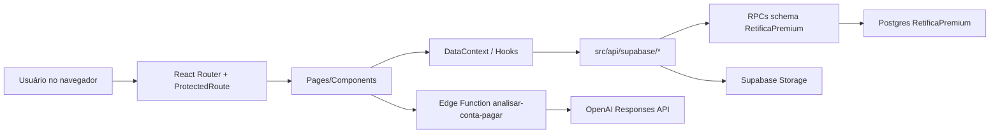

# Contexto Técnico Completo — Retiflow / Retífica Premium

> Atualizado em: 2026-04-27
> Repositório local: `/Users/gabrielwilliamdepaulo/Documents/RetificaPremium/retiflow`
> GitHub: `Gabrieldepaulo20/RetiFlow`
> Branch principal: `main`
> Último commit validado neste contexto: `ff4f719 test: validate real Supabase integration and storage flows`
> Escopo desta documentação: sistema Retiflow exceto Nota Fiscal, que ainda deve ser tratada como fora da v1/piloto.

Este arquivo foi escrito para ser entregue a outro modelo de IA ou revisor técnico. A intenção é dar contexto suficiente para análise de arquitetura, segurança, banco, frontend, integração Supabase, riscos restantes e oportunidades de melhoria.

---

## 1. Resumo Executivo

O Retiflow é uma SPA em React/Vite para operação de uma retífica. O sistema evoluiu de uma base visual/local para uma aplicação parcialmente conectada ao Supabase real. Hoje, os fluxos mais importantes para piloto controlado estão conectados de verdade: autenticação real, clientes, notas de serviço, Kanban/status, fechamento mensal, contas a pagar, anexos privados de contas, sugestões de e-mail, logs e testes de integração reais.

Estado atual honesto:

| Área | Estado |
|---|---|
| Auth real | Funcional via Supabase Auth + perfil interno em schema `RetificaPremium` |
| Rotas protegidas | Protegidas no frontend por `ProtectedRoute`; backend precisa continuar validando RPC/RLS |
| Clientes | Integrado ao Supabase via RPCs |
| Notas de serviço/O.S. | Integradas ao Supabase via RPCs; PDF é gerado no front e salvo no Storage |
| Preview/PDF de O.S. | Funcional e otimizado visualmente, mas deve ser validado manualmente em vários tamanhos de tela/impressão |
| Fechamento mensal | Integrado ao Supabase para geração/salvamento/PDF; rascunhos ainda usam `localStorage` de forma intencional |
| Contas a pagar | Integrado ao Supabase via RPCs, storage privado, IA via Edge Function |
| Sugestões de e-mail | Agora conectadas a RPC real, não mais local-only |
| Logs/histórico | Agora lê e insere no Supabase via `get_logs`/`insert_log` |
| Nota Fiscal | Fora da v1; há mocks/toasts fake na tela `Invoices.tsx` |
| Configurações | Parcial/local; empresa, tema, logo, senha e prévias ainda não estão totalmente persistidos no backend |
| Testes | Unit tests e integration tests reais passando |

Validações executadas recentemente:

| Comando | Resultado |
|---|---|
| `npx tsc --noEmit` | Passou |
| `npm run build` | Passou |
| `npm run lint` | Passou com warnings, sem erros |
| `npm test -- --run` | 170 testes passaram |
| `npm run test:integration` | 5 arquivos, 24 testes passaram contra Supabase real |

Avisos ainda existentes:

- `npm run lint` tem 9 warnings antigos, principalmente Fast Refresh em componentes UI e uma dependência de hook em `NoteFormCore.tsx`.
- Build alerta chunks grandes, especialmente `react-pdf.browser`, `xlsx`, charts e bundle principal.
- O bucket `notas` retorna URL pública atualmente; isso deve ser revisto para produção com dados sensíveis.
- Tokens Supabase ficam no navegador, como em qualquer SPA com Supabase Auth. Isso exige CSP forte, ausência de XSS e RPC/RLS bem feitos no banco.

---

## 2. Stack e Premissas

| Camada | Tecnologia |
|---|---|
| Frontend | Vite + React 18 + TypeScript |
| Roteamento | React Router v6 |
| UI | Tailwind CSS + Radix UI/shadcn-style |
| Estado global legado | `DataContext` |
| Server state parcial | TanStack Query em áreas de admin/usuários |
| Auth | Supabase Auth em `VITE_AUTH_MODE=real`; mock em dev |
| Banco | Supabase Postgres, schema customizado `RetificaPremium` |
| API | RPCs Postgres via `.schema('RetificaPremium').rpc()` |
| Storage | Supabase Storage |
| Edge Function | `analisar-conta-pagar`, Deno + OpenAI Responses API |
| PDF | `@react-pdf/renderer` + templates React |
| Deploy | AWS Amplify conectado ao GitHub/main |

Padrão importante:

- O frontend não chama tabelas diretamente para dados de negócio principais.
- A camada `src/api/supabase/*` encapsula RPCs e Storage.
- O schema usado é `RetificaPremium`.
- A service role key nunca deve ir para o frontend.
- O frontend usa anon key pública e access token de usuário autenticado.

---

## 3. Arquitetura de Pastas

```txt
src/
  App.tsx
    Define providers globais, BrowserRouter, layouts, rotas protegidas e lazy loading.

  api/
    supabase/
      _base.ts
        Gateway `callRPC()`. Valida envelope padrão `{ status, mensagem, dados }`.
      auth.ts
        Login/perfil/sessão via Supabase.
      clientes.ts
        RPCs e adapters de clientes.
      notas.ts
        RPCs de notas de serviço/compra, status, upload PDF O.S.
      fechamentos.ts
        RPCs de fechamento, upload PDF privado, signed URL.
      contas-pagar.ts
        RPCs de contas, anexos, storage privado, Edge Function de IA.
      categorias.ts
        Categorias de contas a pagar.
      fornecedores.ts
        Fornecedores.
      sugestoes-email.ts
        Sugestões de e-mail e aceite/ignore via RPC.
      logs.ts
        Leitura e inserção de logs.
      usuarios.ts
        Usuários internos e módulos/permissões.
      catalogo.ts
        Catálogos: tipos de motor, serviços, peças/produtos.

  components/
    auth/
      ProtectedRoute.tsx
        Proteção frontend por auth, role e módulo.
    clients/
      Formulários e detalhes de cliente.
    notes/
      Formulário, detalhe, PDF template de O.S.
    closing/
      Templates HTML/PDF de fechamento.
    payables/
      Módulo Contas a Pagar: criação, detalhes, importação IA, sugestões.
    layout/
      Layout operacional e admin.
    ui/
      Componentes base.

  contexts/
    AuthContext.tsx
      Sessão, login/logout, permissões de módulo.
    DataContext.tsx
      Estado global e bridge entre legado localStorage + Supabase real.

  services/
    auth/
      Providers real/mock, permissões, mapeamento de usuários Supabase.
    domain/
      Regras puras de domínio: clientes, notas, contas, fechamento.
    storage/
      Helpers de localStorage versionado.

  pages/
    Login.tsx / AdminLogin.tsx
    Dashboard.tsx
    Clients.tsx / ClientForm.tsx / ClientDetail.tsx
    IntakeNotes.tsx / IntakeNoteForm.tsx / IntakeNoteDetail.tsx
    Kanban.tsx
    MonthlyClosing.tsx
    ContasAPagar.tsx / ContaPagarForm.tsx / ImportarContaPagar.tsx
    Settings.tsx
    Invoices.tsx
    admin/AdminDashboard.tsx / admin/AdminClients.tsx

  test/
    Unit/domain/UI tests.
    integration/
      Testes reais contra Supabase, isolados por `.env.integration`.

supabase/
  functions/
    analisar-conta-pagar/
      Edge Function que autentica usuário, valida arquivo e chama OpenAI.
  migrations/
    20260426153000_create_contas_pagar_storage.sql
      Bucket privado `contas-pagar` e policies de storage.
    20260427143000_grant_custom_schema_to_service_roles.sql
      Grants para service_role e supabase_auth_admin no schema customizado.

docs/
  contexto-sessao.md
```

---

## 4. Fluxo Arquitetural Geral



Responsabilidades:

- Componentes cuidam de UI, modais, formulários e feedback.
- `services/domain/*` concentra regras puras e testáveis.
- `api/supabase/*` concentra integração externa.
- `DataContext` ainda é uma peça central de compatibilidade; ele deve ser reduzido no futuro em favor de hooks por domínio/TanStack Query.
- RPCs são a fronteira real de segurança e consistência do backend.

---

## 5. Autenticação e Autorização

### 5.1 Modos de Auth

Arquivo principal: `src/services/auth/authProvider.ts`

- `VITE_AUTH_MODE=mock`: usa mock local para desenvolvimento.
- `VITE_AUTH_MODE=real`: usa Supabase Auth.
- Em build de produção (`import.meta.env.PROD`) com mode diferente de `real`, o provider lança erro e bloqueia uso silencioso de auth mock em produção.

### 5.2 Auth real

Arquivos:

- `src/lib/supabase.ts`
- `src/services/auth/realAuthProvider.ts`
- `src/contexts/AuthContext.tsx`

Fluxo:

1. Usuário faz login com `supabase.auth.signInWithPassword`.
2. Supabase retorna `access_token`, `refresh_token`, `expires_at`.
3. App chama RPC `get_usuario_por_auth_id` no schema `RetificaPremium`.
4. Perfil interno é convertido via `dbUserToSystemUser`.
5. Em modo real, o app mantém somente o perfil do usuário no estado React.
6. A persistência de tokens fica exclusivamente com o Supabase SDK (`persistSession: true`).
7. `auth.session` continua existindo apenas para modo mock/dev e é removido automaticamente no modo real.

### 5.3 Risco do access token no navegador

Este é um ponto importante de segurança:

- A `VITE_SUPABASE_ANON_KEY` é pública por design e fica no bundle frontend.
- A anon key sozinha não deve dar acesso amplo; quem protege é RLS/RPC/auth checks.
- Após login, o navegador recebe `access_token` e `refresh_token`.
- Se houver XSS, extensão maliciosa ou script de terceiro comprometido, um atacante pode roubar o token.
- Com o token roubado, o atacante pode chamar diretamente qualquer RPC/Storage permitido àquele usuário, mesmo sem passar pela UI.
- Portanto, `ProtectedRoute` não é segurança suficiente. Ele só protege navegação visual.
- Segurança real precisa estar no banco/Storage/Edge Functions.

Estado atual:

- Edge Function de IA exige `Authorization: Bearer <access_token>` e valida `auth.getUser(token)`.
- Integration tests validam que RPCs críticas de contas a pagar retornam 401 sem auth.
- O app usa RPCs para operações principais, evitando acesso direto a tabelas pelo frontend.
- Ainda é necessário auditar função por função no banco para garantir que todas verificam `auth.uid()`, usuário ativo e permissões/módulos quando aplicável.

Recomendações para endurecer:

- CSP forte em produção, sem `unsafe-inline` quando possível.
- Evitar bibliotecas/scripts externos desnecessários.
- Não armazenar dados sensíveis adicionais em `localStorage`.
- O espelhamento manual de tokens em `auth.session` foi removido no modo real; não reintroduzir sem uma justificativa forte.
- Implementar checks de permissão/módulo no backend para RPCs sensíveis, não apenas no frontend.
- Tornar todos os buckets com documentos sensíveis privados e usar signed URLs curtas.

### 5.4 Ataque por alteração de URL

Se alguém alterar a URL manualmente, por exemplo `/admin` ou `/contas-a-pagar`:

- O `ProtectedRoute` verifica sessão, role e módulo no frontend.
- Usuário não autenticado é redirecionado para login.
- Usuário sem módulo é redirecionado para `/acesso-negado`.

Limite:

- Isso não impede chamadas diretas a RPCs se o atacante tiver token válido.
- A proteção definitiva precisa estar nas RPCs/RLS.

---

## 6. Supabase — Arquitetura

### 6.1 Projeto e ambiente

Projeto Supabase vinculado localmente:

- Project ref usado nos testes: `dqeoxxokvvcpssajycgq`
- Nome local observado: `Portal de Notas`
- Schema principal: `RetificaPremium`

Arquivos sensíveis:

- `.env.local`: ignorado pelo git.
- `.env.integration`: ignorado pelo git.
- `.env.integration.example`: versionado, sem segredos.

Variáveis relevantes:

```txt
VITE_AUTH_MODE=real
VITE_SUPABASE_URL=...
VITE_SUPABASE_ANON_KEY=...
VITE_SUPABASE_PAYABLE_ATTACHMENTS_BUCKET=contas-pagar
OPENAI_API_KEY=...        # somente em Supabase Function secret
```

Não deve existir no frontend:

```txt
VITE_SUPABASE_SERVICE_ROLE_KEY
OPENAI_API_KEY
AWS_SECRET_ACCESS_KEY
```

### 6.2 Padrão de RPC

Arquivo: `src/api/supabase/_base.ts`

```ts
supabase.schema('RetificaPremium').rpc(rpcName, params)
```

Contrato esperado:

```ts
{
  status: number;
  mensagem: string;
  total?: number;
  dados?: T;
}
```

Exceções conhecidas:

- `get_conta_pagar_detalhes` retorna envelope/objeto com dados na raiz (`conta`, `anexos`, `historico`, `parcelas`), por isso o wrapper aceita `env.dados ?? env`.
- `insert_log` retorna `void`, por isso não usa `callRPC()`, chama `supabase.schema(...).rpc()` diretamente e valida apenas erro de transporte.
- Algumas mutations de fechamento podem retornar `void` ou envelope; `fechamentos.ts` tem `callMutationRPC()` para isso.

### 6.3 Mapeamento de wrappers e RPCs consumidas

| Arquivo | Funções frontend | RPC/Storage/Function |
|---|---|---|
| `_base.ts` | `callRPC`, `extractDados` | Gateway RPC |
| `auth.ts` | `autenticar`, `sair`, `getPerfil`, `getSessaoAtual` | Supabase Auth, `get_usuario_por_auth_id` |
| `clientes.ts` | `getClientes`, `getClienteDetalhes`, `novoCliente`, `salvarClienteCompleto`, `updateCliente`, `inativarCliente`, `reativarCliente` | `get_clientes`, `get_cliente_detalhes`, `novo_cliente`, `salvar_cliente_completo`, `update_cliente`, `inativar_cliente`, `reativar_cliente` |
| `notas.ts` | `getNotasServico`, `getNotaServicoDetalhes`, `updateNotaPdfUrl`, `uploadNotaPDF`, `getNotasCompra`, `getNotaCompraDetalhes`, `getStatusNotas`, `novaNota`, `updateNotaServico` | `get_notas_servico`, `get_nota_servico_detalhes`, `update_nota_pdf_url`, Storage `notas`, `get_notas_compra`, `get_nota_compra_detalhes`, `get_status_notas`, `nova_nota`, `update_nota_servico` |
| `fechamentos.ts` | `getFechamentos`, `insertFechamento`, `updateFechamento`, `registrarAcaoFechamento`, `getNotaDetalhesParaFechamento`, `uploadFechamentoPDF`, `getFechamentoPDFSignedUrl` | `get_fechamentos`, `insert_fechamento`, `update_fechamento`, `registrar_acao_fechamento`, `get_nota_servico_detalhes`, Storage privado `fechamentos` |
| `contas-pagar.ts` | `getContasPagar`, `getContaPagarDetalhes`, `insertContaPagar`, `updateContaPagar`, `registrarPagamento`, `cancelarContaPagar`, `excluirContaPagar`, `insertAnexoContaPagar`, `uploadAnexoContaPagar`, `getAnexoContaPagarUrl`, `analisarContaPagarComIA` | RPCs de contas, Storage privado `contas-pagar`, Edge Function `analisar-conta-pagar` |
| `categorias.ts` | `getCategorias`, `insertCategoria`, `updateCategoria` | `get_categorias_conta_pagar`, `insert_categoria_conta_pagar`, `update_categoria_conta_pagar` |
| `fornecedores.ts` | `getFornecedores`, `insertFornecedor`, `updateFornecedor`, `inativarFornecedor` | `get_fornecedores`, `insert_fornecedor`, `update_fornecedor`, `inativar_fornecedor` |
| `sugestoes-email.ts` | `getSugestoesEmail`, `insertSugestaoEmail`, `aceitarSugestaoEmail`, `ignorarSugestaoEmail` | `get_sugestoes_email`, `insert_sugestao_email`, `aceitar_sugestao_email`, `ignorar_sugestao_email` |
| `logs.ts` | `getLogs`, `insertLog` | `get_logs`, `insert_log` |
| `usuarios.ts` | `getUsuarios`, `insertUsuario`, `updateUsuario`, `inativarUsuario`, `reativarUsuario`, `upsertModulo` | `get_usuarios`, `insert_usuario`, `update_usuario`, `inativar_usuario`, `reativar_usuario`, `upsert_modulo` |
| `catalogo.ts` | `getTiposDeMotor`, `getServicosItens`, `getPecasProdutos` | `get_tipos_de_motor`, `get_servicos_itens`, `get_pecas_produtos` |
| `faturas.ts` | `getFaturas`, `getFaturaDetalhes`, `insertFatura`, `updateFatura`, `cancelarFatura` | RPCs de faturas, porém Nota Fiscal está fora da v1 |

### 6.4 Tabelas/entidades inferidas do banco

Observação transparente: este mapeamento é baseado nos wrappers, tipos, RPCs, testes e migrations versionadas. A introspecção completa via Supabase CLI travou durante tentativa de consulta de metadados em 2026-04-27, então recomenda-se confirmar o dump exato no Dashboard/Supabase SQL antes de grandes mudanças estruturais.

Entidades centrais identificadas:

| Entidade/Tabela provável | Uso | Forma normal / observação |
|---|---|---|
| `Usuarios` | Perfil interno vinculado ao Supabase Auth por `auth_id` | Normalizada; separa Auth externo de perfil de negócio |
| `Modulos` | Permissões de acesso por usuário/módulo | Normalizada; 1:1/1:N com usuário dependendo do desenho |
| `Clientes` | Cadastro de cliente B2B/B2C | Normalizada; documento, status, nome, observação |
| `Contatos` | Telefones/e-mails de cliente | Normalizada; evita colunas repetidas |
| `Enderecos` | Endereço de cliente | Normalizada; usada em `novo_cliente`/`salvar_cliente_completo` |
| `Veiculos` | Veículo vinculado a cliente/nota | Normalizada; modelo, placa, km, motor |
| `Tipos_de_Motor` | Catálogo | Normalizada |
| `Servicos_Itens` | Catálogo de serviços | Normalizada |
| `Pecas_Produtos` | Catálogo de peças/produtos | Normalizada |
| `Status_Notas` | Status de serviço/compra | Normalizada; mapeada para enum frontend |
| `Notas_de_Servico` | O.S./nota de serviço | Normalizada; cabeçalho da nota |
| `Notas_de_Compra` | Notas de compra vinculadas | Existe RPC, uso UI ainda limitado |
| Relação de itens da nota | Itens/serviços/produtos da O.S. | Normalizada; detalhes vêm de `get_nota_servico_detalhes` |
| `Fechamentos` | Fechamento mensal por cliente/período | Híbrido: dados principais + `dados_json` snapshot |
| Histórico de fechamento | Ações/regenerações/downloads | Normalizado via `registrar_acao_fechamento` |
| `Contas_Pagar` | Contas financeiras | Normalizada; status, vencimento, recorrência, valores |
| `Categorias_Conta_Pagar` | Categorias financeiras | Normalizada |
| `Fornecedores` | Fornecedores | Normalizada |
| `Anexos_Conta_Pagar` | Metadados de arquivos no storage | Normalizada; arquivo real fica no Storage |
| `Historico_Conta_Pagar` | Histórico de ações financeiras | Normalizada |
| `Sugestoes_Email` | Sugestões vindas de e-mail/IA | Normalizada; aceita/ignora por RPC |
| `Logs` | Log geral do sistema | Normalizada; lida por `get_logs` |
| `Faturas` | Nota Fiscal/faturas | Fora da v1 |

Sobre formas normais:

- A maior parte do modelo parece aderir a 3FN: entidades separadas, relações por FK, catálogos isolados, anexos como metadados separados.
- Exceção deliberada: `Fechamentos.dados_json` é um snapshot denormalizado da composição do fechamento. Isso é aceitável para documento financeiro congelado/versão impressa, desde que o fechamento não dependa desse JSON para ser fonte única de verdade editável.
- Exceção operacional: rascunhos de fechamento ficam em `localStorage` antes de virar fechamento real no banco. Isso é aceitável como rascunho local, mas não como dado final.
- Atenção: configuração da empresa/modelos/tema ainda não tem persistência real clara.

### 6.5 Buckets de Storage

| Bucket | Público? | Uso | Estado |
|---|---:|---|---|
| `contas-pagar` | Não | Anexos de contas a pagar; PDF, imagens, DOC/DOCX | Criado por migration; policies para authenticated; signed URL de 10 min |
| `fechamentos` | Não | PDFs de fechamento mensal | Usado com signed URL de 1h; integration test valida upload e leitura |
| `notas` | Atualmente retorna public URL | PDFs de O.S./nota de serviço | Funciona, mas deve ser considerado risco de privacidade se documentos contêm dados pessoais |

Recomendação:

- Migrar `notas` para bucket privado com signed URLs, como `fechamentos` e `contas-pagar`.
- Padronizar caminhos por ano/mês/entidade e limpar arquivos órfãos quando registros forem removidos/cancelados.

### 6.6 Edge Function `analisar-conta-pagar`

Arquivo: `supabase/functions/analisar-conta-pagar/index.ts`

Fluxo:

1. Aceita apenas `POST` e `OPTIONS`.
2. Valida `Authorization: Bearer <access_token>`.
3. Usa `SUPABASE_URL` e `SUPABASE_ANON_KEY` dentro da function para chamar `auth.getUser(token)`.
4. Rejeita sem usuário válido.
5. Lê `OPENAI_API_KEY` de secret da Supabase Function.
6. Valida MIME type:
   - PDF
   - PNG/JPEG/WEBP
   - DOC/DOCX
7. Limita arquivo a 15 MB.
8. Envia arquivo para OpenAI Files API com `purpose=user_data`.
9. Chama OpenAI Responses API usando `gpt-4.1-mini`.
10. Pede JSON estruturado com campos de conta a pagar.
11. Sanitiza saída, limita tamanhos, normaliza datas/valores/categorias.
12. Remove arquivo temporário da OpenAI em `finally`.

Pontos positivos:

- Não expõe OpenAI key no frontend.
- Exige usuário autenticado.
- Valida tipo e tamanho.
- Sanitiza resposta da IA.
- Remove arquivo temporário da OpenAI.

Riscos:

- CORS aceita allowlist via `CORS_ALLOWED_ORIGINS`/`ALLOWED_ORIGINS`; sem env configurada mantém `*` por compatibilidade. Como exige bearer token, CORS não abre acesso sozinho, mas a allowlist deve ser definida em produção.
- IA pode errar valor/data. A UI precisa manter revisão/correção humana.
- A categoria fallback depende da lista enviada pelo frontend.

---

## 7. DataContext e Persistência

Arquivo: `src/contexts/DataContext.tsx`

O `DataContext` é o coração legado do app. Ele centraliza dados e ações, e hoje trabalha em dois modos:

- modo mock/desenvolvimento: seed + localStorage;
- modo real: Supabase para entidades principais.

Em modo real (`VITE_AUTH_MODE=real`), o contexto limpa do estado inicial local:

- clientes
- notas
- serviços/produtos
- anexos
- invoices
- atividades/logs
- contas a pagar
- anexos/histórico de contas
- sugestões de e-mail

Depois carrega do Supabase:

- `getClientes`
- `getNotasServico`
- `getStatusNotas`
- `getContasPagar`
- `getCategorias`
- `getFornecedores`
- `getLogs`
- `getSugestoesEmail`

Pontos positivos:

- Evita exibir seed/localStorage antigo em modo real.
- Centraliza adapters Supabase → tipos frontend.
- Permite transição gradual de app local para app real.

Riscos/manutenção:

- `DataContext` está grande e acoplado.
- Mistura UI-state, server-state, persistência local e regra de negócio.
- Longo prazo: dividir por domínio com hooks próprios (`useClients`, `useNotes`, `usePayables`, `useClosings`) e TanStack Query.

---

## 8. Módulos e Estado Real

### 8.1 Login/Auth

| Item | Estado |
|---|---|
| Login operacional | Real via Supabase Auth |
| Login admin | Real via Supabase Auth |
| Perfil interno | RPC `get_usuario_por_auth_id` |
| Usuário inativo | Bloqueado no login real |
| Sessão persistida | Supabase SDK em modo real; `auth.session` apenas em mock/dev |
| Auth mock em produção | Bloqueado por throw em `getAuthProvider()` |

### 8.2 Clientes

Arquivos:

- `src/pages/Clients.tsx`
- `src/components/clients/*`
- `src/api/supabase/clientes.ts`

Funcionalidades:

- listar clientes;
- criar/editar cliente;
- ativar/desativar;
- validar CPF/CNPJ no frontend;
- preencher CEP/CNPJ via serviços externos quando usado;
- contatos e endereço enviados em payload para RPC.

Banco:

- RPCs: `get_clientes`, `get_cliente_detalhes`, `novo_cliente`, `salvar_cliente_completo`, `update_cliente`, `inativar_cliente`, `reativar_cliente`.

Observação:

- Cliente B2B/B2C é suportado pelo cadastro normal.
- Caso empresa mande funcionário trazer a OS, o contato/responsável da OS deve ser modelado no banco se ainda não estiver persistindo como campo próprio.

### 8.3 Notas de Serviço / O.S.

Arquivos:

- `src/pages/IntakeNotes.tsx`
- `src/pages/IntakeNoteForm.tsx`
- `src/pages/IntakeNoteDetail.tsx`
- `src/components/notes/NoteFormCore.tsx`
- `src/components/notes/NoteDetailModal.tsx`
- `src/components/OSPreviewModal.tsx`
- `src/components/notes/NotaPDFTemplate.tsx`
- `src/api/supabase/notas.ts`

Funcionalidades:

- criar nota de serviço com cliente, veículo, placa, km, motor, itens;
- editar nota;
- atualizar status;
- visualizar detalhes;
- gerar PDF no frontend;
- salvar URL do PDF no banco via `update_nota_pdf_url`;
- preview alinhado ao template final.

Validações frontend:

- CPF/CNPJ em cliente.
- Placa brasileira antiga e Mercosul.
- QTD começa vazio em formulário, não com `1`.

Riscos:

- Bucket `notas` retorna URL pública.
- Preview/impressão deve continuar sendo validado manualmente com PDFs reais e telas diferentes.
- Alguns fallbacks locais ainda existem em `NoteDetailModal` para montar PDF se RPC não retornar detalhes.

### 8.4 Kanban

Arquivos:

- `src/pages/Kanban.tsx`
- `src/services/domain/intakeNotes.ts`

Estado:

- Usa notas do `DataContext`.
- Atualização de status faz rollback em caso de erro.
- Visibilidade de colunas usa `localStorage`, o que é aceitável por ser preferência visual.

Risco:

- Permissão de status no backend precisa ser validada por RPC. Frontend sozinho não basta.

### 8.5 Fechamento Mensal

Arquivos:

- `src/pages/MonthlyClosing.tsx`
- `src/components/closing/ClosingPDFTemplate.tsx`
- `src/components/closing/ClosingHtmlPreview.tsx`
- `src/api/supabase/fechamentos.ts`
- `src/services/domain/monthlyClosing.ts`
- `src/hooks/useClosingRecords.ts` (legado/local; verificar se ainda é usado)

Funcionalidades atuais:

- selecionar cliente;
- carregar apenas meses em que aquele cliente tem notas finalizadas/fechadas;
- gerar rascunho local;
- visualizar template em modal;
- gerar fechamento real;
- salvar fechamento no banco;
- gerar PDF;
- upload no bucket privado `fechamentos`;
- signed URL para visualizar/baixar.

Padrões:

- `dados_json` guarda snapshot do fechamento.
- PDF final usa template do app.
- Rascunho fica em `localStorage` até o usuário gerar.

Riscos:

- Rascunho local pode se perder se limpar navegador.
- Edição visual no rascunho precisa estar bem separada de persistência real.
- Performance de preview PDF ainda deve ser monitorada em máquinas mais fracas.

### 8.6 Contas a Pagar

Arquivos:

- `src/pages/ContasAPagar.tsx`
- `src/components/payables/*`
- `src/services/domain/payables.ts`
- `src/api/supabase/contas-pagar.ts`

Funcionalidades:

- listagem;
- filtros por status, período, categoria, origem;
- busca;
- criar conta manual;
- editar campos principais;
- duplicar;
- registrar pagamento total/parcial;
- cancelar/excluir;
- detalhes com anexos, histórico e parcelas;
- importação com IA;
- upload de anexos;
- signed URL de anexo;
- sugestões de e-mail em tab própria.

Banco/RPC:

- `get_contas_pagar`
- `get_conta_pagar_detalhes`
- `insert_conta_pagar`
- `update_conta_pagar`
- `registrar_pagamento`
- `cancelar_conta_pagar`
- `excluir_conta_pagar`
- `insert_anexo_conta_pagar`

Storage:

- bucket privado `contas-pagar`;
- path: `{contaPagarId}/{timestamp}-{filename-sanitizado}`;
- signed URL de 10 minutos.

IA:

- Front chama `analisarContaPagarComIA`.
- Function analisa arquivo e retorna draft.
- UI cria conta e vincula anexo.
- Fluxo suporta múltiplos arquivos com status por arquivo.

Riscos:

- IA nunca deve criar dado financeiro sem possibilidade de revisão/correção humana.
- Parcelamento/recorrência é reconhecido e armazenado, mas UX de agrupamento "notebook 10/10 parcelas" ainda pode melhorar.
- Fornecedores/categorias têm API, mas UI CRUD completa não está separada como módulo próprio.

### 8.7 Sugestões de E-mail

Arquivos:

- `src/components/payables/PayableEmailSuggestions.tsx`
- `src/api/supabase/sugestoes-email.ts`
- `src/contexts/DataContext.tsx`

Estado atual:

- Antes era local.
- Agora carrega `get_sugestoes_email`.
- Aceitar chama `aceitar_sugestao_email` e recarrega contas.
- Ignorar chama `ignorar_sugestao_email`.
- Integration tests validam aceite/ignore contra banco real.

Ainda falta:

- Integração real com Gmail/caixa de e-mail não está implementada no app.
- Hoje o backend já suporta sugestões, mas a ingestão automática de e-mails/boletos ainda precisa ser desenhada.

### 8.8 Logs / Histórico

Arquivos:

- `src/api/supabase/logs.ts`
- `src/contexts/DataContext.tsx`
- `src/test/integration/logs.test.ts`

Estado:

- `getLogs` lê logs reais.
- `insertLog` persiste atividades novas em modo real.
- Teste de integração valida insert + leitura.

Observação:

- `insert_log` retorna `void`, não envelope. Por isso o wrapper trata diferente.

### 8.9 Admin / Usuários / Permissões

Arquivos:

- `src/pages/admin/AdminClients.tsx`
- `src/api/supabase/usuarios.ts`
- `src/services/auth/moduleAccess.ts`
- `src/services/auth/supabaseUserMapping.ts`

Estado:

- Lista usuários via hook/API.
- Cria perfil interno via `insert_usuario`.
- Ativa/inativa via RPC.
- Atualiza módulos por usuário via `upsert_modulo`.

Limite importante:

- Criar usuário interno não necessariamente cria conta no Supabase Auth. A UI informa isso.
- Reset de senha é pendente de integração segura com Supabase Auth/Admin API e não deve ser feito direto do frontend.
- Permissões por módulo existem no frontend e em `Modulos`, mas é necessário garantir que RPCs sensíveis também respeitam permissões no banco.

### 8.10 Configurações

Arquivo:

- `src/pages/Settings.tsx`

Estado honesto:

- Dados da empresa, logo, tema, modelos e segurança são parcialmente locais/visuais.
- A tela mostra aviso: "Algumas seções ainda são locais".
- `COMPANY_SETTINGS_CONNECTED = false`.
- `SECURITY_SETTINGS_CONNECTED = false`.
- Prévia de modelos usa dados mock (`mockClient`, `mockNote`, `mockServicesShort`, `mockServicesLong`).

Não considerar 100% pronto para produção.

### 8.11 Nota Fiscal

Arquivo:

- `src/pages/Invoices.tsx`

Estado:

- Fora do escopo da v1/piloto.
- Existem toasts explicitamente mockados:
  - `PDF baixado (mock)`
  - `Imprimindo... (mock)`
  - `Enviado (mock)`

Recomendação:

- Esconder/desabilitar rota/módulo Nota Fiscal na v1 ou manter claramente marcado como indisponível.

---

## 9. Segurança — Estado Atual e Riscos

### 9.1 O que está bom

- Service role não está no frontend.
- `.env.local` e `.env.integration` estão no `.gitignore`.
- Auth mock é bloqueado em build de produção se `VITE_AUTH_MODE !== real`.
- RPCs críticas de contas a pagar foram testadas sem auth e retornam 401.
- Edge Function de IA valida bearer token.
- Storage de contas a pagar e fechamento usa bucket privado + signed URLs.
- Upload de conta a pagar sanitiza nome de arquivo.
- Edge Function valida MIME type e tamanho máximo.
- OpenAI key fica como secret da Supabase Function.

### 9.2 Riscos reais

| Risco | Impacto | Recomendação |
|---|---|---|
| Access token no navegador | XSS pode roubar token e chamar RPCs | CSP forte, evitar scripts externos, auditoria XSS, RLS/RPC estritos |
| Access/refresh token persistidos pelo Supabase SDK | Normal em SPA, mas XSS ainda pode roubar/usar sessão | CSP forte, evitar scripts externos, auditoria XSS, RPC/RLS estritos |
| Proteção de rota só no frontend | Atacante com token pode chamar RPC direto | Validar role/módulo também no banco |
| Bucket `notas` público | PDFs de O.S. podem conter PII | Migrar para bucket privado + signed URL |
| CORS sem allowlist configurada na Edge Function | Mantém compatibilidade com `*`; com env configurada restringe origem | Definir `CORS_ALLOWED_ORIGINS`/`ALLOWED_ORIGINS` no projeto Supabase de produção |
| Configurações locais | Usuário pode achar que salvou configuração real | Manter avisos/desabilitar salvar até persistir |
| Nota Fiscal mockada | Usuário pode acreditar que está funcionando | Fora da v1 ou desabilitar rota |
| Projeto Supabase real usado em integration tests | Risco de sujeira/dados teste em ambiente principal | Criar Supabase Branch/projeto separado para testes |

### 9.3 Perguntas de segurança para próximo revisor/modelo

- Todas as RPCs fazem `auth.uid()` e validam usuário ativo?
- RPCs financeiras validam permissões do módulo `contas_a_pagar` no backend?
- RPCs admin validam role administrador no backend?
- Storage policies restringem objetos por usuário/tenant ou apenas `authenticated`?
- PDFs de O.S. devem ser privados?
- O app precisa de multi-tenant no futuro? Se sim, todas as tabelas precisam de `tenant_id`/empresa.

---

## 10. Testes

### 10.1 Unit/domain/UI

Comando:

```bash
npm test -- --run
```

Resultado recente:

- 12 arquivos
- 170 testes
- 170 passaram

Cobertura por intenção:

- geração de IDs;
- regras de notas;
- permissões;
- rotas protegidas;
- fechamento mensal domain;
- storage helpers;
- auth flow;
- app routes;
- Kanban;
- edição de nota.

### 10.2 Integration tests reais

Config:

- `vitest.integration.config.ts`
- `.env.integration` ignorado pelo git
- `fileParallelism: false`
- `sequence.concurrent: false`

Comando:

```bash
npm run test:integration
```

Resultado recente:

- 5 arquivos
- 24 testes
- 24 passaram

Arquivos:

| Teste | O que valida |
|---|---|
| `auth.test.ts` | Login real, perfil, logout, RPC sem auth |
| `contas-pagar.test.ts` | Auth guard 401, insert/list/update/pay/cancel/detail/history |
| `storage.test.ts` | Upload PDF fechamento privado + signed URL; upload anexo conta + DB link + signed URL |
| `sugestoes-email.test.ts` | Aceitar cria conta real; ignorar não cria conta |
| `logs.test.ts` | `insert_log` persiste e `get_logs` lê |

Migration aplicada para testes/Auth Admin:

- `20260427143000_grant_custom_schema_to_service_roles.sql`
- Concede `usage` e permissões necessárias para `service_role`.
- Concede `usage`/execute para `supabase_auth_admin` resolver trigger `auth.users -> RetificaPremium.ao_criar_usuario_auth()`.

---

## 11. Histórico Recente de Correções Feitas

Principais commits recentes:

| Commit | Resumo |
|---|---|
| `ff4f719` | Valida integração real Supabase e storage flows |
| `709e933` | Endurece harness de integration tests |
| `d99e31f` | Corrige bloqueadores P0 antes da v1 |
| `9395274` | Persiste anexos de importação IA |
| `663b952` | Corrige auth seguro da Edge Function de IA |

O que foi feito recentemente:

- Integração real validada contra Supabase.
- Testes storage/fechamento/anexos criados.
- Testes sugestões de e-mail criados.
- Testes logs criados.
- Harness de integração passou a pular limpo sem credenciais.
- Harness roda arquivos em série para evitar corrida no DB/Auth.
- `get_conta_pagar_detalhes` corrigido para retorno de dados na raiz.
- `insert_log` corrigido por retornar `void`.
- `DataContext` em modo real deixou de hidratar sugestões/logs/contas de seed/localStorage.
- Sugestões de e-mail passaram de local para RPC real.
- Logs passaram a persistir no banco.
- Storage `contas-pagar` privado criado por migration.
- Grants do schema customizado para service_role/supabase_auth_admin adicionados.

---

## 12. Mocks, LocalStorage e Pontos Não 100% Reais

Esta seção é intencionalmente transparente.

### 12.1 Mocks explícitos

| Local | Tipo | Observação |
|---|---|---|
| `src/pages/Invoices.tsx` | Nota Fiscal mock | Fora da v1; há ações fake de baixar/imprimir/enviar |
| `src/pages/Settings.tsx` | Preview de modelo com dados mock | Usado para prévia visual |
| `src/data/seed.ts` | Dados demo | Usado em `VITE_AUTH_MODE=mock` |
| `src/services/auth/mockAuthProvider.ts` | Auth dev | Bloqueado em produção por `getAuthProvider()` |

### 12.2 LocalStorage aceitável

| Local | Uso | Aceitável? |
|---|---|---|
| `auth.session` | sessão mock/dev sem tokens reais | Sim, bloqueado no modo real |
| Supabase SDK session | auth persistente real | Normal para SPA |
| Kanban column visibility | preferência visual | Sim |
| Monthly closing drafts | rascunho antes de gerar | Sim, desde que fique claro que não é fechamento salvo |
| `DataContext` em modo mock | demo/dev | Sim |

### 12.3 LocalStorage/parcial que merece evolução

| Local | Problema | Recomendação |
|---|---|---|
| `Settings.tsx` empresa/logo/tema/senha | Configuração local/visual | Criar tabela/RPC `Configuracoes_Empresa` |
| `moduleAccess.ts` role config | Parte das permissões por perfil ainda local | Persistir role-level config no banco ou remover UI se não usada |
| `useClosingRecords.ts` | Hook legado de fechamento local | Confirmar se ainda está morto; remover se não usado |

---

## 13. Produção / Piloto — Veredito Atual

Veredito:

- Pode publicar para piloto controlado, excluindo Nota Fiscal.
- Não declarar 100% produção ampla sem:
  - revisar bucket `notas`;
  - validar manualmente impressão/PDF;
  - auditar todas as RPCs no banco para permissões;
  - finalizar settings ou esconder partes locais;
  - usar ambiente separado para integration tests.

Pronto para piloto:

- Auth/login.
- Clientes.
- Notas de serviço/O.S.
- Kanban.
- Fechamento mensal.
- Contas a pagar.
- Anexos de contas.
- Sugestões de e-mail como backend/UI.
- Logs.

Fora da v1:

- Nota Fiscal.
- Integração real com Gmail/e-mail automático.
- Configurações avançadas persistidas.
- Reset de senha por admin.

---

## 14. Checklist de Release

### Obrigatório antes de publicar

- Garantir `VITE_AUTH_MODE=real` no Amplify.
- Garantir `VITE_SUPABASE_URL` e `VITE_SUPABASE_ANON_KEY` corretas no Amplify.
- Garantir `OPENAI_API_KEY` configurada em Supabase Function secret, não no frontend.
- Garantir Edge Function `analisar-conta-pagar` deployada.
- Rodar:
  - `npx tsc --noEmit`
  - `npm run build`
  - `npm run lint`
  - `npm test -- --run`
  - `npm run test:integration` com ambiente configurado
- Desabilitar ou deixar Nota Fiscal claramente fora da v1.
- Testar manualmente:
  - login/logout;
  - criar/editar cliente;
  - criar/editar O.S.;
  - gerar/preview/baixar/imprimir PDF O.S.;
  - mover O.S. no Kanban;
  - gerar rascunho e fechamento real;
  - baixar/visualizar PDF fechamento;
  - criar conta a pagar manual;
  - importar conta com IA;
  - abrir anexo por signed URL;
  - registrar pagamento;
  - cancelar conta.

### P1 logo após piloto

- Migrar bucket `notas` para privado.
- Criar ambiente Supabase separado para integration tests.
- Persistir configurações da empresa/modelos.
- Auditar permissões server-side por módulo/role em todas as RPCs.
- Melhorar bundle splitting para `react-pdf`, `xlsx`, charts.
- Corrigir warnings de lint.

### P2 melhorias

- Substituir gradualmente `DataContext` por hooks por domínio + TanStack Query.
- Criar módulo CRUD de fornecedores/categorias.
- Ingestão real de e-mail/Gmail para sugestões.
- Tela de agrupamento avançado de parcelamentos/recorrências.
- Observabilidade: logs estruturados, métricas, Sentry/AWS RUM mais completo.

---

## 15. Pontos de Investigação para Outro Modelo

Perguntas úteis para uma próxima auditoria:

1. O schema `RetificaPremium` está totalmente protegido por RLS ou por RPCs `SECURITY DEFINER` com checks adequados?
2. Alguma RPC `SECURITY DEFINER` permite alteração sem validar `auth.uid()`?
3. As permissões de módulos (`Modulos`) são aplicadas no banco ou só no frontend?
4. O bucket `notas` deve ser privado antes do piloto?
5. A configuração `CORS_ALLOWED_ORIGINS`/`ALLOWED_ORIGINS` já está definida no Supabase de produção?
6. Há risco de escalation entre usuários financeiros/admin via RPC?
7. O fechamento mensal deve ter tabela normalizada de itens ou `dados_json` snapshot é suficiente para o negócio?
8. A Edge Function deveria restringir CORS para o domínio do Amplify?
9. Como modelar corretamente empresa/configurações/templates sem deixar mock local?
10. Quais chunks grandes precisam de code-splitting prioritário?

---

## 16. Nota Sobre Introspecção do Banco

Durante a atualização deste arquivo, uma tentativa de consultar metadados completos do Supabase via `supabase db query --linked` travou no passo `Initialising login role...`. Por segurança, os processos foram encerrados e este contexto foi montado com base em:

- wrappers reais em `src/api/supabase/*`;
- testes de integração reais;
- migrations versionadas;
- fluxos e páginas do frontend;
- uso real de Storage/Edge Function.

Antes de mudanças grandes no banco, recomenda-se gerar um dump/introspecção oficial no Dashboard Supabase ou corrigir a conectividade da CLI para extrair:

- lista completa de tabelas/colunas;
- FKs;
- indexes;
- RLS policies;
- views/materialized views;
- triggers;
- funções `SECURITY DEFINER`;
- grants efetivos.
